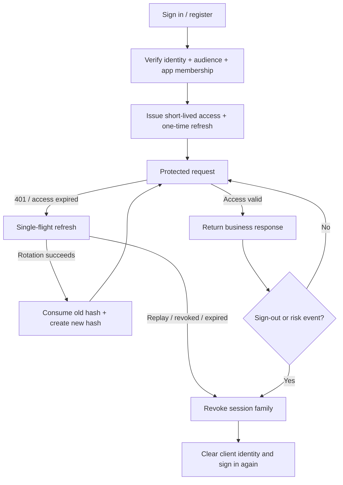

# Server API

AppKernia describes its server contract with OpenAPI 3.1. These pages explain common routes, examples, and security boundaries; `server/openapi/openapi.yaml` in the current repository remains the final source for fields, enums, status codes, and schemas.

[Download the current OpenAPI YAML](/openapi.yaml)

| Surface      | Prefix          | Client                         | Identity boundary                          |
| ------------ | --------------- | ------------------------------ | ------------------------------------------ |
| App API      | `/api/v1`       | uni-app x and app users        | `ak-mobile` bearer token                   |
| Admin API    | `/admin-api/v1` | React Admin                    | `ak-admin` access token plus secure cookie |
| Internal API | `/internal/v1`  | Health and internal monitoring | Deployment network boundary                |

Admin and Mobile tokens are not interchangeable. `X-AppID` selects a public active app; tenant and user scope still come from the verified session.

## Authentication flow

<div className="ak-diagram" role="group" aria-label="AppKernia API authentication and refresh flow">



</div>

<p className="ak-diagram-summary">Admin and Mobile use separate entry points and audiences. Refresh is a controlled one-time session rotation, not an automatic replay mechanism for arbitrary failed requests.</p>

Admin and Mobile have separate entry points and audiences. A client must not blindly replay a failed write; automatic retry is allowed only when the endpoint has explicit idempotency semantics described in [conventions](./conventions).

## API families

| Family          | Typical resources                                  | Start here                             |
| --------------- | -------------------------------------------------- | -------------------------------------- |
| Public App      | Config, regions, dictionaries, version, legal      | [Mobile resources](./mobile-resources) |
| Mobile identity | Sign-in, refresh, sign-out, recovery, registration | [Mobile authentication](./mobile-auth) |
| Mobile user     | Profile, preferences, notifications, sessions      | [Mobile resources](./mobile-resources) |
| Admin identity  | Sign-in, refresh, MFA, sessions                    | [Admin authentication](./admin-auth)   |
| Admin business  | Users, org, access, content, files, jobs           | [Admin core resources](./admin-core)   |
| Internal        | Live, ready, metrics                               | Deployment network only                |

```http
Accept: application/json
Accept-Language: en-US
X-Request-ID: 019…
X-AppID: 01900000-0000-7000-8000-000000000001
Authorization: Bearer YOUR_ACCESS_TOKEN
```

## First request without authentication

After the local API starts, request public config with the development App ID from the repository manifest:

```bash
curl --fail-with-body \
  -H 'Accept: application/json' \
  -H 'Accept-Language: en-US' \
  -H 'X-AppID: 00000000-0000-4000-8000-000000000001' \
  http://127.0.0.1:8080/api/v1/public/config
```

A successful response has a 2xx status, a stable `code`, matching `Content-Language`, and no server secret.

## Integration checklist

- Generate clients from OpenAPI and verify the schema hash in CI.
- Mobile calls only `/api/v1`; Admin calls only `/admin-api/v1`.
- Send `Accept-Language` on every request; preserve Request IDs without logging tokens.
- Cover denied paths with backend authorization tests—menus and buttons are not evidence.
- Define idempotency keys, retry limits, and audit behavior for writes.
- Validate SQL isolation with integration data from two tenants.

Start with [conventions](./conventions), [Mobile authentication](./mobile-auth), [Mobile resources](./mobile-resources), [Admin authentication](./admin-auth), or [Admin core resources](./admin-core).

<div class="ak-doc-callout"><strong>Version status</strong>The current API is 0.1.0 and the project has no stable release yet. Generate clients from OpenAPI and verify the schema hash instead of maintaining hand-written DTOs from this page.</div>
