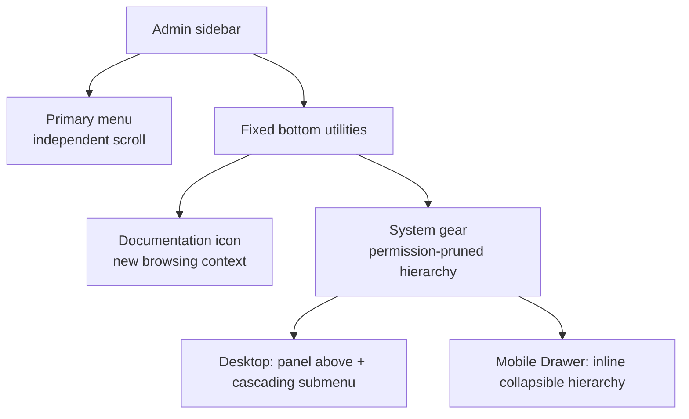

# Online OpenAPI reference and System menu

AK Admin ships a public, self-hosted OpenAPI 3.1 reference in the Admin image. It reads the repository's single `server/openapi/openapi.yaml` source to browse operations, search modules, inspect schemas, and send manual test requests. It does not create or maintain a second business specification.

<strong>Entry location</strong>After signing in to Admin, the bottom of the left sidebar contains a documentation icon and a System gear. Documentation stays on the left and System on the right. Documentation opens a new browsing context without replacing the current Admin page.

## Entry points and menu structure

System remains a top-level data node in the database and authorization context. Only its Shell presentation changes; routes, feature flags, permissions, menu assignments, and backend authorization retain their existing semantics.

### Documentation entry

| Context                   | Address or action                                               |
| ------------------------- | --------------------------------------------------------------- |
| Inside Admin              | Select the documentation icon at the bottom-left of the sidebar |
| Default local Docker port | `http://127.0.0.1:4174/openapi/?lang=en-US`                     |
| Vite development server   | `http://127.0.0.1:4173/openapi/?lang=en-US`                     |
| Deployed environment      | `<Admin Origin>/openapi/?lang=en-US`                            |
| Raw specification         | `<Admin Origin>/openapi/openapi.yaml`                           |

The online reference does not require an Admin login. `lang` accepts only `zh-CN` or `en-US`; an explicit query parameter takes precedence over the browser language. The Admin documentation icon automatically carries the current Admin locale.

This public documentation site also copies a read-only artifact from the same canonical file at build time: [download the current OpenAPI YAML](/openapi.yaml).

### System menu entry

- The primary menu has its own scrolling region. The bottom utilities remain fixed instead of being pushed below long navigation trees.
- On desktop, selecting the gear opens a bounded panel with border, radius, and shadow above the trigger. System capability groups appear directly, and third-level pages are available through cascading submenus.
- The mobile Drawer uses a scrollable inline hierarchy so nested items stay within the viewport.
- On a System route, the gear shows an active state and opens the current ancestors. Navigation closes the panel and also closes the mobile Drawer.
- Outside click or `Esc` closes the panel and restores focus to the gear. Arrow navigation, visible focus rings, and Reduced Motion are part of acceptance coverage.
- If permission and feature-flag pruning leaves no accessible System page, the gear is hidden while documentation remains available. Both utilities disappear when the entire sidebar is hidden.

## Reference hierarchy and localized titles

The reference navigation uses three levels—surface, business module, then operation—and preserves the business order declared by the specification. Operation lists start collapsed and are not alphabetized.

| Surface                  | Modules                                                                                                                                                                                                                                                                                   |
| ------------------------ | ----------------------------------------------------------------------------------------------------------------------------------------------------------------------------------------------------------------------------------------------------------------------------------------- |
| Platform and Public APIs | Platform health, App public capabilities, public content, public dictionaries, API Client authentication                                                                                                                                                                                  |
| Mobile APIs              | Authentication, profile and preferences, devices and sessions, notifications, security events, bookmarks and legal consent                                                                                                                                                                |
| Admin APIs               | Authentication and profile, Dashboard, App management, Upgrade center, App content, App notifications, App users, organization, tenants, users, permissions, system settings, files, content, notifications, jobs, API Clients, webhooks, audit and security, online sessions and runtime |

The canonical YAML assigns exactly one stable tag to every visible operation and declares surfaces and modules through top-level `tags` and `x-tagGroups`. Build validation rejects ungrouped operations, duplicate `operationId` values, unknown tags, missing translations, or drift between English titles and canonical summaries.

Changing `?lang=zh-CN` or `?lang=en-US` updates:

- surface names;
- module names;
- operation titles in the sidebar, search results, and document body;
- Scalar interface text such as search, requests, and responses.

Parameters, responses, schemas, examples, and detailed descriptions remain canonical English. The browser replaces only group names and operation `summary` values in an in-memory display object. Paths, methods, `operationId`, security, schemas, and original tag codes remain unchanged. Direct downloads always return the raw YAML; there is no locale-specific copy of the specification.

## Interactive-request security boundary

<strong>Real-request warning</strong>Requests sent from the reference reach the current environment. Confirm the target environment, parameters, and authorization scope before creating, changing, or deleting data.

- The reference does not read the Admin in-memory access token and never pre-fills Admin credentials.
- Every test request uses `credentials: "omit"`, so the Admin HttpOnly cookie is not attached.
- Requests send an `Accept-Language` value matching the reference locale.
- Protected operations require a manually entered Bearer token. With `persistAuth=false`, authorization is cleared on refresh.
- Scalar Agent, telemetry, developer tools, remote proxying, external fonts, and plugin URLs are disabled.
- Same-origin proxying continues for `/api/` and `/admin-api/`. Only the exact live and ready health routes are exposed; all other `/internal/` paths are denied, including metrics.

Never copy real tokens, cookies, secrets, or personal data into screenshots, issues, logs, or test fixtures.

## Dismissing the top warning

The interactive-request warning at the top of the reference has a localized accessible close name, supports keyboard operation, and displays a visible focus ring.

Dismissal is stored only in the current tab's `sessionStorage`:

- a refresh in the same tab keeps it hidden;
- a new tab or browsing context displays it again;
- if a privacy-restricted context blocks storage, dismissal still works for the current page but the warning may return after refresh.

This keeps the notice from repeatedly obscuring the reference without hiding write-request risk permanently.

## Self-hosting, caching, and response security

The reference is an independent Vite multipage entry in the Admin build. Scalar, the YAML parser, localized operation titles, and reference styling stay in the OpenAPI dependency graph and do not enter the Admin SPA's initial graph.

- HTML and YAML use revalidation caching; hashed assets use long-lived immutable caching.
- The page sets a self-contained CSP, `nosniff`, `no-referrer`, iframe denial, and a constrained Permissions Policy.
- The build compares `/openapi/openapi.yaml` byte-for-byte with the canonical file and rejects locale-specific specification artifacts.
- `@scalar/api-reference` is pinned to `1.64.1`, self-hosted in the Admin image, and recorded under the repository's MIT third-party notices.

## Change boundary

This update changes only documentation presentation and the Admin Shell information architecture:

- no business API wire contract is added or changed;
- the database menu structure, System seed, permission codes, and backend authorization are unchanged;
- the existing three-level System hierarchy is not flattened;
- OpenAPI grouping metadata does not change generated-client public signatures.

Continue with [API conventions](./conventions), [Admin authentication](./admin-auth), [Admin core resources](./admin-core), and [architecture](../concepts/architecture).
