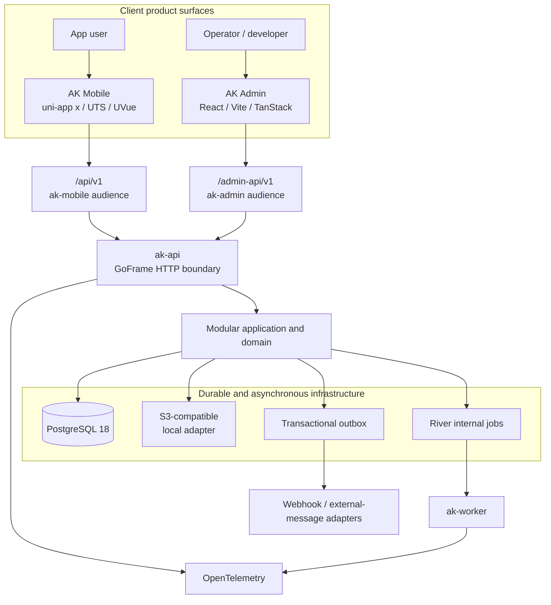
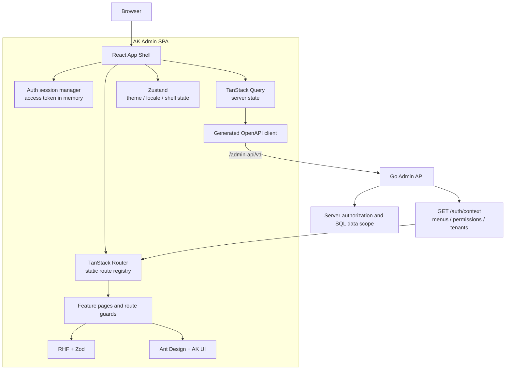
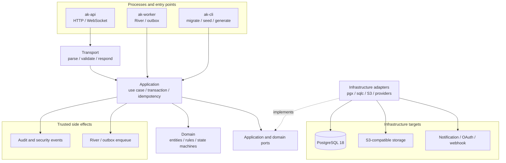
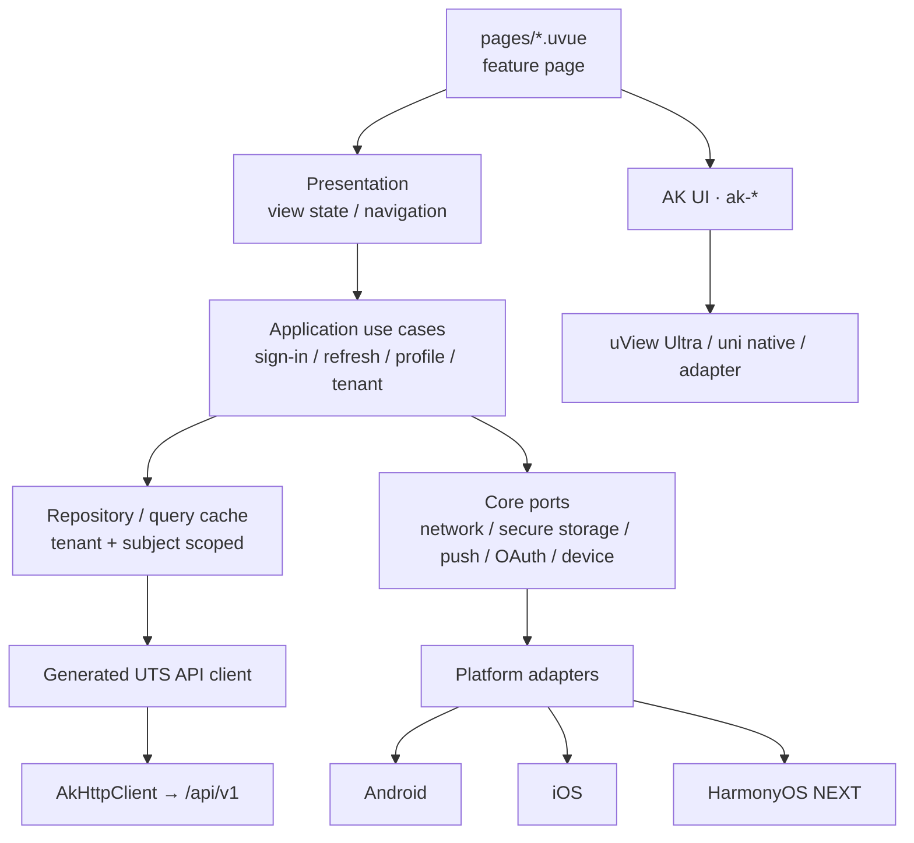

# Architecture

AppKernia is a three-surface system where one modular-monolith server drives two client classes. Admin and Mobile share durable business facts and an OpenAPI contract while keeping separate route prefixes, token audiences, interaction models, and local-storage policies.

Two client classes enter distinct security boundaries, but the same server modules, transactions, and data constraints own business facts. Worker, outbox, and OpenTelemetry complete the asynchronous and operational path.

## Admin / Web architecture

Admin routes exist statically at build time and server menus reference only allowed registry keys. TanStack Query owns server data while Zustand owns shell state; buttons and route guards improve UX but never replace Go API authorization.

## Server architecture

The modular monolith preserves one transactional deployment boundary while Application, Domain, and ports isolate business logic from infrastructure. Auditable PostgreSQL/sqlc code retains critical tenant filters, locks, and constraints.

## Mobile architecture

Feature pages compose features and `ak-*` components; they do not build API URLs, read or write tokens, or call platform SDKs directly. Platform claims still require independent build, installation, and device evidence.

## Responsibilities of the three surfaces

### AK Mobile

AK Mobile uses uni-app x, UTS/UVue, and VDOM. Feature pages reach platform and network capabilities through `ak-*` components, application use cases, and ports.

### AK Admin

AK Admin is a React SPA that only calls `/admin-api/v1`. Routes are statically compiled, menus are filtered by the server, and the Go API remains the final authorization boundary.

System remains a top-level data menu, but the Shell presents it through the bottom sidebar gear while the primary menu scrolls independently. The adjacent documentation icon opens a public, independently built OpenAPI page that neither reads Admin session credentials nor changes route and permission semantics. See [online OpenAPI reference and System menu](../api/online-reference).

### AK Server

AK Server uses GoFrame at the HTTP boundary and pgx/v5 plus sqlc for PostgreSQL. API, worker, and CLI share one codebase. River handles internal jobs and a transactional outbox handles external events.

`server/openapi/openapi.yaml` is the final API source of truth. A contract change updates routes, use cases, database/permissions/audit when relevant, generated clients, and tests together.

| Change                   | Check together                                                                   |
| ------------------------ | -------------------------------------------------------------------------------- |
| API field or response    | OpenAPI, Go implementation, both generated clients, contract tests               |
| Permission or data scope | Permission seed, backend middleware/application, SQL filter, denied-path tests   |
| User-visible message     | Stable error code, `zh-CN`/`en-US` catalogs, `Content-Language`, and UI          |
| Asynchronous side effect | Transaction boundary, River/outbox, idempotency, retry, audit, and observability |
