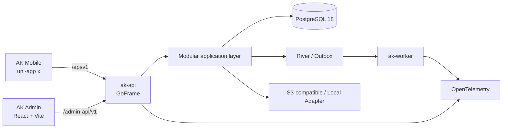

# Architecture



## Three product surfaces

AK Mobile uses uni-app x, UTS/UVue, and VDOM. Feature pages reach platform and network capabilities through `ak-*` components, application use cases, and ports.

AK Admin is a React SPA that only calls `/admin-api/v1`. Routes are statically compiled, menus are filtered by the server, and the Go API remains the final authorization boundary.

AK Server uses GoFrame at the HTTP boundary and pgx/v5 plus sqlc for PostgreSQL:

```text
Transport → Application → Domain
Infrastructure → Application/Domain Port
```

API, worker, and CLI share one codebase. River handles internal jobs and a transactional outbox handles external events.

`server/openapi/openapi.yaml` is the final API source of truth. A contract change updates routes, use cases, database/permissions/audit when relevant, generated clients, and tests together.
