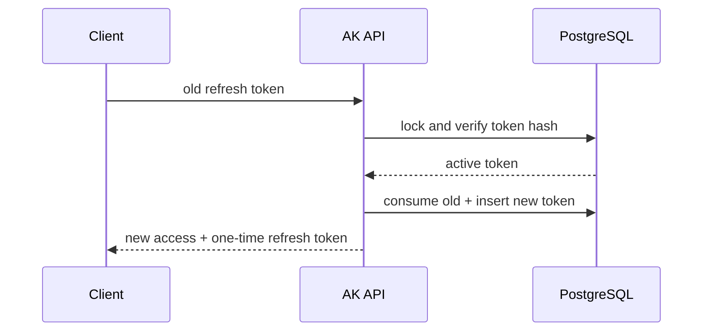

# Authentication and sessions

| Token         | Purpose                     | Client storage                                             | Server storage                  |
| ------------- | --------------------------- | ---------------------------------------------------------- | ------------------------------- |
| Access token  | Short-lived API identity    | Memory only in Admin and Mobile                            | Not a long-lived session record |
| Refresh token | Rotating session credential | Admin Secure HttpOnly cookie; Mobile system secure storage | SHA-256 hash only               |

Access tokens use Ed25519/EdDSA, expire after about 15 minutes by default, and isolate `ak-mobile`, `ak-admin`, and `ak-api` audiences.

Only one concurrent use of an old token can succeed. Reuse of an already consumed token revokes the session family and creates a security event.

- 401 refresh is single-flight and retries the original request at most once.
- 403 never triggers refresh.
- Writes without idempotency are not replayed automatically.
- Logout, tenant switch, and session invalidation clear protected caches.
