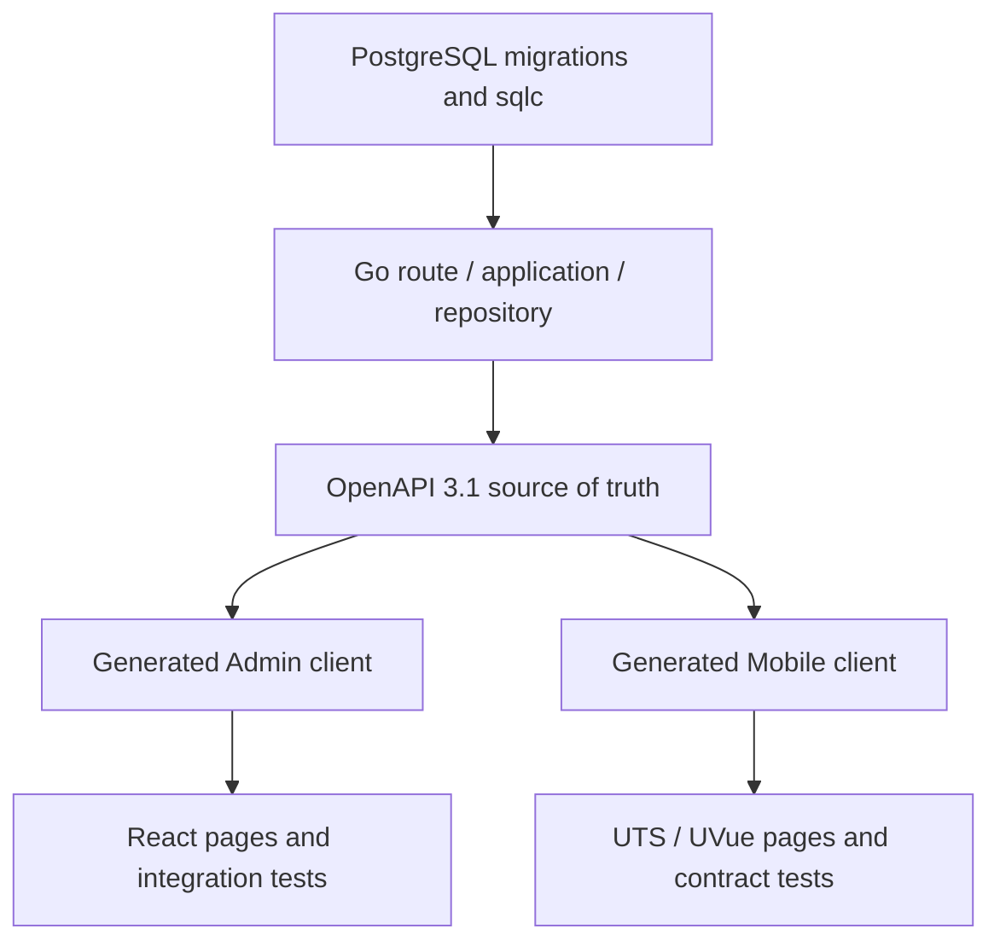
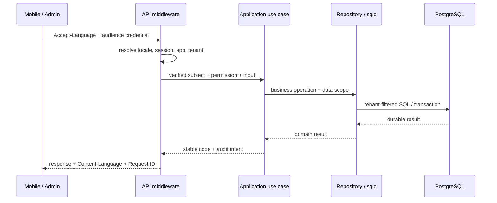

# Core concepts

AppKernia's value comes from shared boundaries, not only from a list of technologies.

## The three-surface contract chain

An API change starts with durable data and server rules, moves through OpenAPI into two generated clients, then reaches Admin and Mobile pages and tests.

An API change is never only a Handler edit. When fields, permissions, or data scope change, the server implementation, OpenAPI, database, permission seed, generated clients, and integration tests move together. A temporary hand-written DTO can compile while still creating runtime drift.

## Responsibility boundaries

| Layer        | Owns                                                     | Must not own                                       |
| ------------ | -------------------------------------------------------- | -------------------------------------------------- |
| Mobile       | User tasks, device state, offline/platform UX            | Trusting client-supplied tenant, role, or user     |
| Admin        | Operations workflows, forms, menus, data-scope UX        | Replacing server authorization with hidden buttons |
| API / Worker | Authorization, idempotency, audit, jobs, business rules  | Delegating security decisions to clients           |
| PostgreSQL   | Constraints, transactions, tenant filters, durable facts | Unvalidated dynamic execution                      |

## How one request moves

The client supplies request context, but trusted user, tenant, permission, and data scope are resolved on the server; SQL enforces isolation and the client branches only on stable status.

1. The client sends `Accept-Language`; Mobile also sends public `X-AppID`, and protected calls use credentials for the correct audience.
2. The API resolves locale, session, app, and tenant, then derives permission and data scope from verified server context.
3. The application layer enforces business rules; repository/sqlc code applies transactions and tenant filters in SQL.
4. Responses use stable business codes and `Content-Language`; clients branch on codes rather than localized copy.
5. Relevant writes produce audit or security events, while asynchronous work moves to the Worker.

- [Architecture](./architecture)
- [Authentication and sessions](./authentication)
- [Authorization and multi-tenancy](./permissions-tenancy)
- [Internationalization](./internationalization)
- [Security model](./security)
