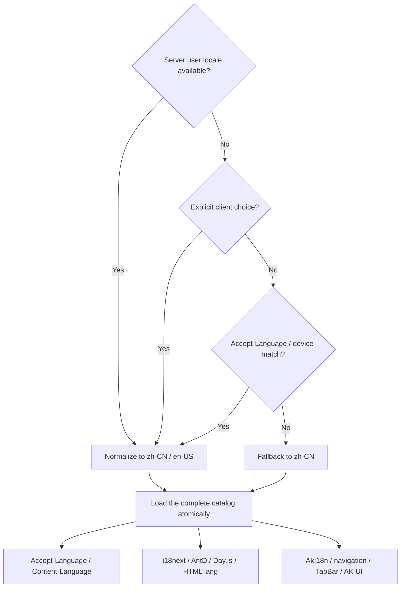

# Internationalization

The first release accepts canonical `zh-CN` and `en-US`. The default and final fallback are `zh-CN`. Aliases such as `zh`, `zh-Hans`, `zh_CN`, and `en` are normalized first.

For signed-in users:

All locale aliases normalize to `zh-CN` or `en-US`, and the UI changes only after the complete catalog loads. A failure keeps the previous locale instead of producing a partially translated screen.

Every request sends `Accept-Language`; the server returns `Content-Language` and adds `Vary: Accept-Language` to language-dependent cacheable responses.

- Business logic uses stable error codes, never translated display messages.
- Time stays RFC 3339 UTC and money stays an integer in the smallest currency unit.
- Admin synchronizes i18next, Ant Design, Day.js, HTML `lang`, and titles.
- Mobile synchronizes AkI18n, navigation titles, TabBar, AK UI, and later requests.
- Both catalogs must have identical keys and placeholder sets.

Dynamic menus use stable `i18n_key` values, while business errors use stable `error.code` and `message_key`. A localized server `message` is a display fallback, never a client-side decision key.
