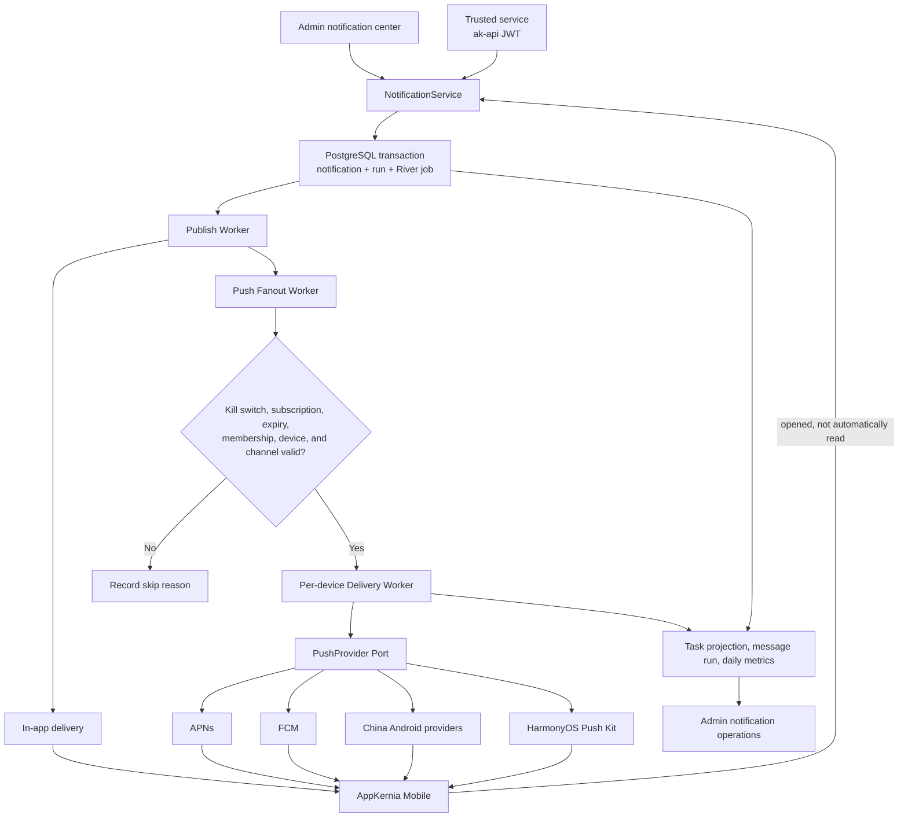

# Notification and push architecture

AppKernia does not send to every device inside an HTTP request. The server uses **PostgreSQL + River** for asynchronous jobs and commits the notification, run record, and queued job in the same database transaction.

The pipeline serves Admin publishing, trusted service submissions, and Mobile in-app notifications. In-app delivery is the baseline: it remains available when a user disables push, a device has no supported provider, or a provider delivery fails.

## End-to-end data flow

The synchronous request performs trusted validation and commits a transaction. Workers publish, fan out to devices, and call providers asynchronously. Business facts and jobs share PostgreSQL to avoid partial dual writes.

## Three notification jobs

| Task kind                         | Purpose                                                  | Max attempts | Worker timeout |
| --------------------------------- | -------------------------------------------------------- | -----------: | -------------: |
| `appkernia-message-publish`       | Publish scheduled messages and deliver in-app recipients |            5 |     30 seconds |
| `appkernia-push-fanout`           | Evaluate subscriptions and create per-device deliveries  |            5 |     90 seconds |
| `appkernia-notification-delivery` | Decrypt one device token and call its provider           |            5 |     90 seconds |

All three use the `notifications` queue. Business modules depend on `platform/jobqueue`, not on the River Client. Task kind, queue, maximum attempts, timeout, and automatically retryable classes are registered at compile time.

## Sources of truth

| Data                                    | Purpose                                                          | Retention            |
| --------------------------------------- | ---------------------------------------------------------------- | -------------------- |
| `river_job`                             | River's live scheduling state                                    | River runtime policy |
| `notify.messages` / `notify.recipients` | Notification snapshot, frozen audience, and in-app delivery fact | Notification policy  |
| `notify.deliveries`                     | Per-device acceptance, failure, invalid token, and open events   | Notification policy  |
| `notify.message_runs`                   | Pipeline state from scheduling through delivery completion       | 90-day detail        |
| `jobs.task_runs` / `jobs.task_attempts` | Tenant/App-scoped job index, attempt result, and Trace ID        | 90-day detail        |
| `notify.delivery_daily_metrics`         | Daily metrics by app, environment, channel, provider, and result | 13 months            |

Task projections never store River Args, full stacks, tokens, payloads, secrets, or raw provider responses. Use the Trace ID from a safe summary to investigate the full trace in the deployment's observability stack.

## Delivery result semantics

| Normalized result     | Behavior                                                                                                  |
| --------------------- | --------------------------------------------------------------------------------------------------------- |
| `accepted`            | Mark provider acceptance; this does not promise that the device displayed the notification                |
| `invalid_token`       | Stop the delivery and immediately invalidate the device binding                                           |
| `throttled`           | Honor `Retry-After`, exponential backoff, and jitter                                                      |
| `transient`           | Retry a clearly transient failure automatically                                                           |
| `permanent`           | Do not retry automatically                                                                                |
| `auth_config_error`   | Fault the channel; fix and preflight it before a manual retry                                             |
| `unknown_after_write` | Do not replay automatically; the provider may have accepted it, so only a risk-confirmed retry is allowed |

Workers safely no-op when a notification has been cancelled or expired, or when a duplicate job arrives. An operator retry creates a new task linked to the original instead of rewriting River history.

## Security boundaries

- A global kill switch, app/environment channel state, user subscription, and OS permission all gate push delivery.
- Tokens are encrypted and deduplicated with an HMAC hash. Credentials are write-only and encrypted; Admin APIs never return plaintext.
- A notification-open payload permits only a schema version, delivery/message IDs, a controlled `route_key`, an opaque resource ID, and bounded route parameters.
- Arbitrary URLs, component names, dynamic scripts, silent wake-up, and arbitrary background execution are unsupported.
- Prometheus labels use low-cardinality dimensions such as App, Provider, Category, and Result—never user IDs or tokens.

## Acceptance boundary

A mock provider, source compilation, or provider acceptance does not prove a real device displayed a notification. Before production enablement, validate each provider's account entitlement, credentials, package or bundle identity, signing fingerprint, privacy/network behavior, and foreground, background, terminated, offline-recovery, and notification-open behavior on physical devices.

Continue with [Push channel configuration](../guide/push-channels), [Notification operations](../guide/notification-operations), [Notification API](../api/mobile-notifications), and the [Mobile permission center](../guide/mobile-permissions).
