# Authorization and multi-tenancy

AppKernia separates visibility from authority:

- `sys.menus` describes Admin navigation.
- `iam.permissions.code`, such as `iam.user.read`, is a backend authorization fact.
- A hidden button improves UX but never replaces API authorization.
- `tenant_id` comes from a verified session context, never from an untrusted body or query.

```mermaid
flowchart LR
  accTitle: AppKernia authorization and multi-tenancy decision chain
  accDescr: Visible menus and buttons provide client guidance; after a request reaches the API, the server resolves user and tenant from the session, checks permission, and compiles data scope into SQL conditions.
  Context["GET /auth/context"] --> Menu["Admin menu / route guard"]
  Context --> Button["Page button / AkCan"]
  Menu --> Request["Request /api/v1 or /admin-api/v1"]
  Button --> Request
  Request --> Session["Verify session + audience"]
  Session --> Tenant["Resolve active tenant on server"]
  Tenant --> Permission["Check stable permission code"]
  Permission --> Scope["Merge role and organization data scope"]
  Scope --> SQL["Repository / sqlc injects SQL filter"]
  SQL --> Result["Return only authorized tenant data"]
```

Menus and buttons can prevent an invalid action early, but authority starts with the session, audience, and tenant context and must end in backend permission checks and SQL data scope.

Roles use `all`, `tenant`, `department`, `department_tree`, `self`, or `custom` data scopes. Repositories translate effective scope into SQL conditions; filtering a full dataset in Go or the client is prohibited.

With multiple roles, the application computes effective scope from the current tenant, role validity, and organization relationship before a repository builds parameterized SQL. A tenant switch clears protected client cache so data from the previous tenant cannot be reused accidentally.

| Client | Route prefix    | Audience    |
| ------ | --------------- | ----------- |
| Mobile | `/api/v1`       | `ak-mobile` |
| Admin  | `/admin-api/v1` | `ak-admin`  |

Even for the same user, Admin tokens cannot act as Mobile sessions and vice versa.
