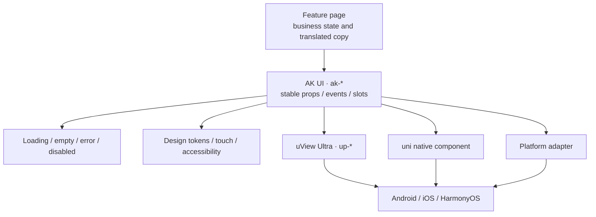

# AK Mobile components

Business pages use components exported by `apps/ak-mobile/components/ak-ui`. AK UI isolates tokens, platform compatibility, touch sizing, event types, and the underlying uView or native implementation.

Pages see only the stable semantic `ak-*` contract, while underlying libraries and platform differences stay in the adapter layer. Compatibility fixes do not require every business page to change.

<strong>Scope</strong>This reference only documents components that exist in the current source. Conditional or not-yet-implemented entries such as AkPicker, AkDatePicker, and AkTabs are not presented as available.

## Choosing a component

1. Start with the semantically closest `ak-*` component; propose a new component only when the current layer cannot express the need.
2. Keep data fetching, authorization, and business state in the Feature Page rather than a presentational component.
3. Contain platform differences in AK UI or a platform adapter; feature pages do not accumulate scattered platform checks.
4. Define loading, empty, error, disabled, long-text, and bilingual behavior before visual polish.
5. If a feature seems to require direct `up-*` use, extend the AK UI adapter instead of creating a second public API in business pages.

## Props, events, and slots

| Contract | Rule                                                                                             |
| -------- | ------------------------------------------------------------------------------------------------ |
| Props    | Use stable serializable UTS types; pages translate visible copy before passing it in             |
| Events   | Name semantic actions that already happened; loading/disabled states do not emit duplicates      |
| Slots    | Expose explicit content regions only; slots cannot bypass state, spacing, or accessibility rules |
| Model    | Document update timing, failure rollback, and platform differences for two-way state             |
| Style    | Prefer design tokens and page overrides; arbitrary CSS is not a public input                     |

The Props/Event/Slot tables on component pages reflect current source. A new field updates implementation, example, bilingual reference, platform evidence, and validation together.

| Component                           | Purpose                                 | Status      |
| ----------------------------------- | --------------------------------------- | ----------- |
| [`ak-button`](./button)             | Primary, secondary, danger, loading     | Implemented |
| [`ak-text-field`](./text-field)     | Label, input, password, disabled, error | Implemented |
| [`ak-card`](./layout-status)        | Content container                       | Implemented |
| [`ak-cell-list`](./layout-status)   | Settings/profile list container         | Implemented |
| [`ak-empty-state`](./layout-status) | Empty state and next action             | Implemented |
| [`ak-loading`](./layout-status)     | Local loading label                     | Implemented |
| [`ak-status-view`](./layout-status) | Loading/empty/error state composition   | Implemented |
| [`ak-modal`](./modal-switch)        | High-risk confirmation                  | Implemented |
| [`ak-switch`](./modal-switch)       | Boolean settings                        | Implemented |
| [`ak-icon`](./icons-theme)          | Controlled semantic icons               | Implemented |
| [`ak-back-button`](./icons-theme)   | Safe back with fallback                 | Implemented |
| [`ak-theme-root`](./icons-theme)    | Theme root                              | Implemented |

Visible strings are translated by the page through AkI18n and passed in. Touch targets are at least 44×44. Loading/disabled states prevent repeated submission. Business pages never use `up-*` directly. Platform availability still requires matching Android, iOS, and HarmonyOS build/device evidence.

## Reading platform evidence

- **Static check passed** means types, imports, and constraints align; it is not a platform build.
- **Platform build passed** means that compiler completed; it is not install, launch, or interaction acceptance.
- **Simulator passed** covers only the named OS, version, and device model—not hardware.
- **Physical device passed** records platform, OS, device, build type, and screenshot/log evidence.
- **HarmonyOS runtime claims** require matching HBuilderX/DevEco output and real-device evidence.
