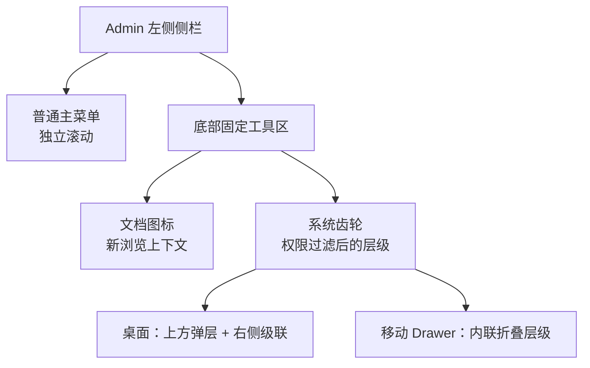

# 在线 OpenAPI 文档与系统菜单

AK Admin 随镜像提供一套公开、自托管的 OpenAPI 3.1 在线文档。它直接读取仓库唯一的 `server/openapi/openapi.yaml`，用于浏览接口、搜索模块、查看 Schema 和手动发起测试请求；不会生成或维护第二份业务规范。

<strong>入口位置</strong>登录 Admin 后，左侧侧栏最底部固定显示文档图标和系统齿轮。文档在左、系统在右；文档会打开新的浏览上下文，不替换当前管理页面。

## 入口与菜单结构

System 仍是数据库和权限上下文中的一级菜单，只改变 Shell 的视觉入口；路由、Feature Flag、权限、菜单分配和后端授权均保持原有语义。

### 文档入口

| 场景                | 地址或操作                                  |
| ------------------- | ------------------------------------------- |
| Admin 内            | 点击侧栏底部左侧文档图标                    |
| Docker 本机默认端口 | `http://127.0.0.1:4174/openapi/?lang=zh-CN` |
| Vite 开发服务器     | `http://127.0.0.1:4173/openapi/?lang=zh-CN` |
| 部署环境            | `<Admin Origin>/openapi/?lang=zh-CN`        |
| 原始规范下载        | `<Admin Origin>/openapi/openapi.yaml`       |

在线文档无需 Admin 登录。`lang` 只接受 `zh-CN` 或 `en-US`；显式查询参数优先于浏览器语言。文档图标会自动附带当前 Admin 语言。

本公共文档站也会在构建时从同一 canonical 文件同步一份只读下载产物：[下载当前 OpenAPI YAML](/openapi.yaml)。

### 系统菜单入口

- 普通主菜单拥有自己的滚动区，底部工具区始终固定，不会被长菜单推离视口。
- 桌面端点击齿轮后，在按钮上方展示带边框、圆角和阴影的限高面板；System 二级能力域直接显示，三级页面通过右侧级联菜单访问。
- 移动 Drawer 使用可滚动的内联折叠层级，避免子菜单越出屏幕。
- 当前位于 System 路由时，齿轮显示选中态并自动展开祖先；跳转后关闭面板，移动端同时关闭 Drawer。
- 点击外部或按 `Esc` 可关闭面板；关闭后焦点回到齿轮。方向键、清晰焦点环和 Reduced Motion 均纳入验收。
- 权限和 Feature Flag 过滤后没有任何 System 页面时，齿轮隐藏；文档入口仍保留。完全隐藏侧栏时，两个入口一起隐藏。

## 文档导航与双语标题

文档左侧导航固定为“接口面 → 业务模块 → 接口”三级，并按规范中的业务顺序呈现。模块中的接口列表默认折叠，不进行字母排序。

| 接口面         | 模块                                                                                                                                                                                     |
| -------------- | ---------------------------------------------------------------------------------------------------------------------------------------------------------------------------------------- |
| 平台与公共接口 | 健康检查、App 公共能力、公共内容、公共字典、API Client 认证                                                                                                                              |
| 移动端接口     | 认证、个人资料与偏好、设备与会话、通知、安全事件、内容收藏与协议确认                                                                                                                     |
| 管理端接口     | 认证与个人中心、Dashboard、App 管理、升级中心、App 内容、App 通知、App 用户、组织、租户、用户、权限、系统设置、文件、内容、通知、任务、API Client、Webhook、审计安全、在线会话与运行状态 |

canonical YAML 为每个可见 operation 设置唯一稳定 tag，并通过顶层 `tags` 与 `x-tagGroups` 定义接口面和模块。构建门禁会阻止未分组、重复 `operationId`、未知 tag、翻译缺失或中英文标题漂移。

切换 `?lang=zh-CN` 或 `?lang=en-US` 后，以下内容同步变化：

- 接口面名称；
- 模块名称；
- 侧栏、搜索结果和正文中的接口标题；
- Scalar 自身的搜索、响应、请求等界面文案。

参数、响应、Schema、示例和详细说明继续保留 canonical 英文。浏览器只在内存中替换展示对象的分组名称与 `summary`；path、method、`operationId`、security、schema 和原始 tag code 均不改变。直接下载始终得到原始 YAML，不存在按语言复制的规范文件。

## 交互测试的安全边界

<strong>真实请求提醒</strong>文档中的接口测试会向当前环境发送真实请求。执行创建、修改或删除前，请先确认环境、请求参数和授权范围。

- 文档不读取 Admin 内存中的 Access Token，也不会预填管理端凭据。
- 所有测试请求使用 `credentials: "omit"`，不会携带 Admin 的 HttpOnly Cookie。
- 请求自动发送与文档语言一致的 `Accept-Language`。
- 受保护接口需要用户手动输入 Bearer Token；`persistAuth=false`，刷新后授权不会保留。
- 不启用 Scalar Agent、遥测、开发者工具、远程代理、外部字体或插件 URL。
- 同源代理继续支持 `/api/` 与 `/admin-api/`；只开放 live、ready 两个精确健康检查。其他 `/internal/` 路径明确拒绝，metrics 不通过 Admin Nginx 暴露。

不要把真实 Token、Cookie、Secret 或个人数据保存到截图、问题单、日志或测试 Fixture 中。

## 顶部风险提示可以关闭

文档顶部的交互测试风险提示带有双语可访问名称的关闭按钮，可通过键盘操作并显示清晰焦点环。

关闭状态只写入当前标签页的 `sessionStorage`：

- 当前标签页刷新后继续隐藏；
- 新建标签页或新的浏览上下文会重新显示；
- 隐私模式禁止存储时，关闭动作仍可完成，但刷新后可能重新显示。

这一设计既避免反复遮挡文档，也不会让真实写请求风险被永久隐藏。

## 自托管、缓存与安全响应头

在线文档是 Admin Vite 构建中的独立多页面入口。Scalar、YAML 解析器、双语接口标题和样式只进入 OpenAPI 文档依赖图，不进入 Admin 主 SPA 首屏。

- HTML 与 YAML 使用重新验证缓存；哈希静态资源使用长期不可变缓存。
- 页面设置自包含 CSP、`nosniff`、`no-referrer`、禁止 iframe 和受限 Permissions Policy。
- 构建会逐字节比较输出的 `/openapi/openapi.yaml` 与 canonical 文件，并检查没有 locale-specific spec。
- `@scalar/api-reference` 锁定为 `1.64.1`，随 Admin 镜像自托管；MIT 许可记录保存在仓库第三方声明中。

## 变更边界

这次调整只改变文档展示和 Admin Shell 信息架构：

- 没有新增或修改业务 API 的 wire contract；
- 没有改变数据库菜单结构、System Seed、权限码或后端授权；
- 没有扁平化 System 的既有三级层级；
- OpenAPI 分组元数据不会改变生成 Client 的公共签名。

继续阅读：[API 约定](./conventions)、[Admin 认证](./admin-auth)、[Admin 核心资源](./admin-core)和[总体架构](../concepts/architecture)。
