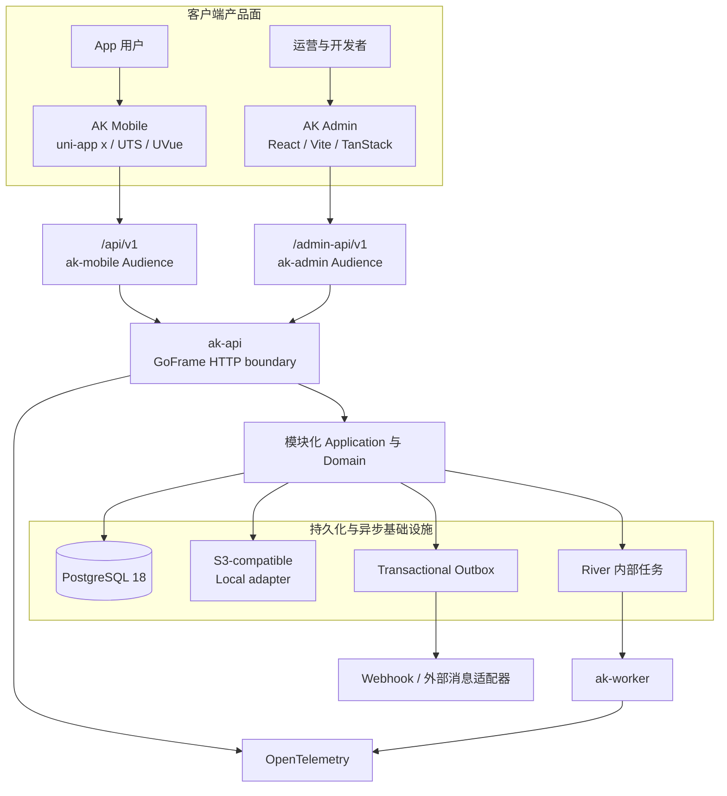
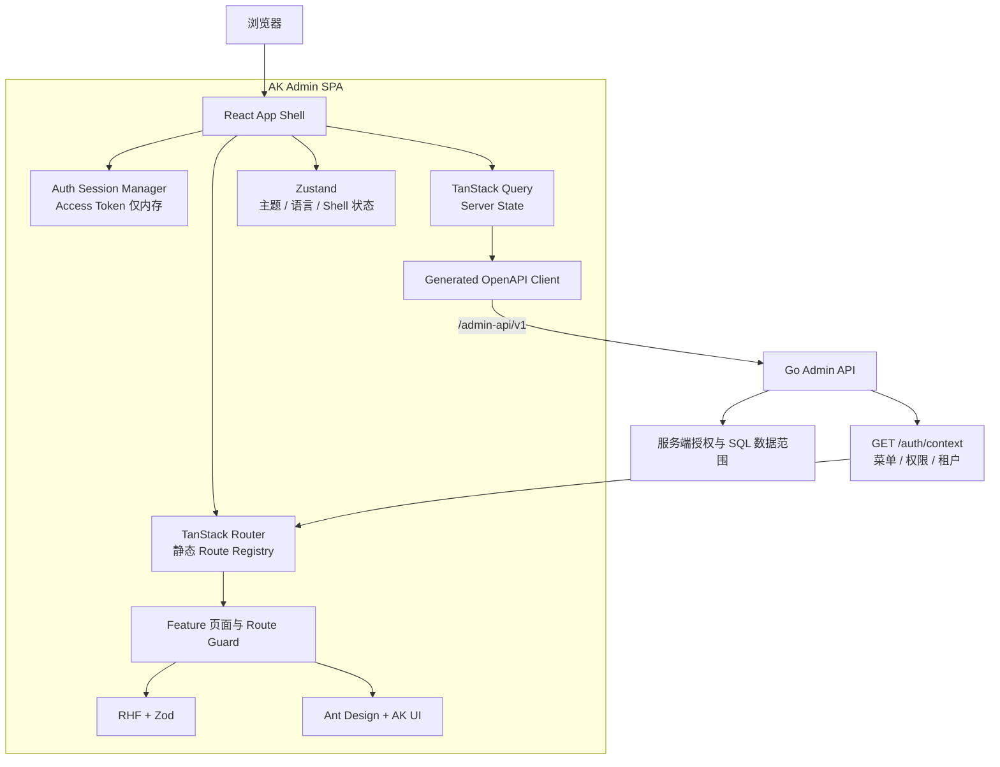
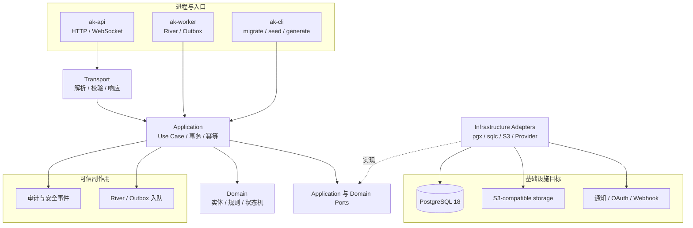
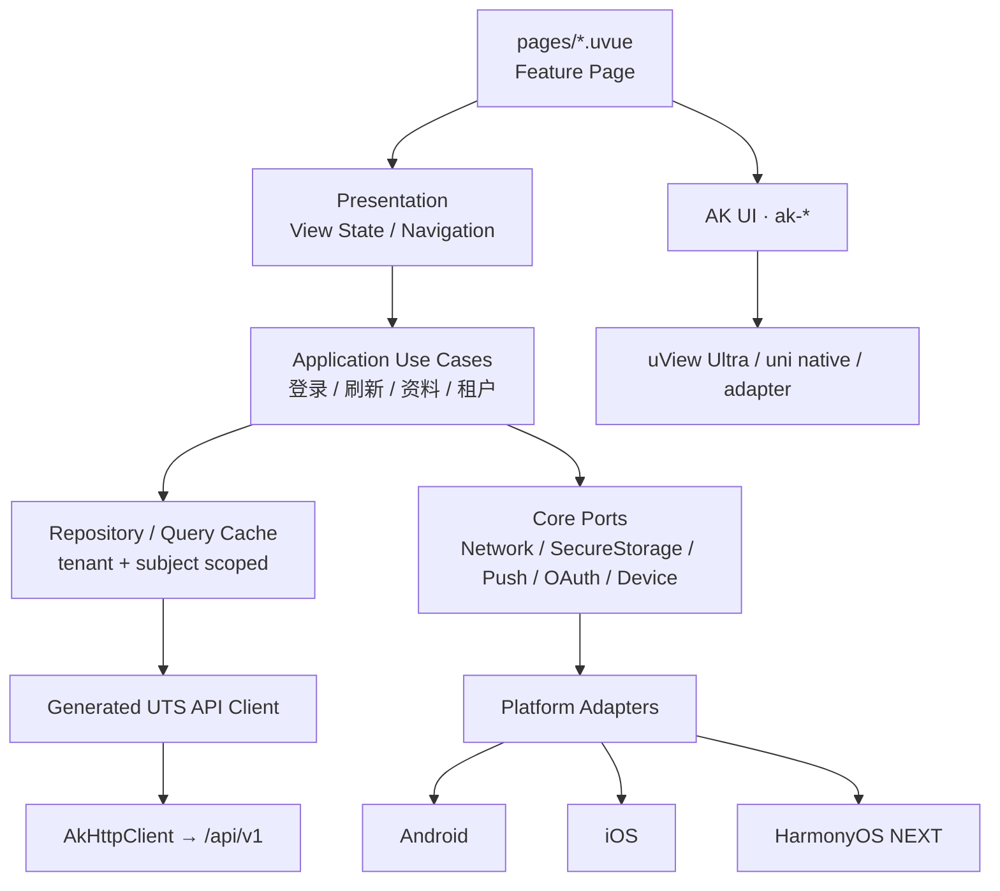

# 总体架构

AppKernia 是一个模块化单体服务端驱动两类客户端的三端系统。Admin 与 Mobile 共享业务事实和 OpenAPI 契约，但使用不同的路由前缀、Token Audience、交互模型和本地存储策略。

两类客户端进入不同的安全边界，但最终由同一组服务端模块、事务和数据约束维护业务事实；Worker、Outbox 和 OpenTelemetry 补齐异步与可观测链路。

## Admin / Web 架构

Admin 的路由代码在构建时静态存在，后端菜单只引用允许的注册键。TanStack Query 管理服务端数据，Zustand 只保存客户端 Shell 状态；按钮和路由守卫改善体验，但不能替代 Go API 授权。

## Server 架构

模块化单体保留一个可事务协作的部署边界，同时用 Application、Domain 与 Port 隔离业务和基础设施。关键租户过滤、锁和约束留在 PostgreSQL/sqlc 可审计实现中。

## Mobile 架构

业务页面只组合 Feature 和 `ak-*` 组件，不直接拼 API URL、读写 Token 或调用平台 SDK。平台声称仍需要目标平台独立的构建、安装与设备证据。

## 三个产品面的职责

### AK Mobile

使用 uni-app x、UTS/UVue 与 VDOM。业务页面通过 `ak-*` 组件、Application Use Case 与 Port 访问平台和网络能力，避免直接依赖原生 SDK 或 uView 细节。

### AK Admin

React SPA 只访问 `/admin-api/v1`。路由代码静态编译，菜单由服务端过滤，最终授权仍由 Go API 强制执行。

System 在数据层继续是一级菜单，但 Shell 将它放到侧栏底部齿轮；普通主菜单独立滚动。旁边的文档图标打开公开、独立构建的 OpenAPI 页面，既不读取 Admin 会话凭据，也不改变现有路由和权限语义。详见[在线 OpenAPI 文档与系统菜单](../api/online-reference)。

### AK Server

GoFrame 负责 HTTP 边界，pgx/v5 + sqlc 负责 PostgreSQL 数据访问。API、Worker 与 CLI 共享代码库；内部任务使用 River，外部事件使用 Transactional Outbox。

## 契约先行

`server/openapi/openapi.yaml` 是 API 最终事实源。Admin 和 Mobile 从契约生成类型；任何接口改动必须同时更新路由、用例、数据库/权限/审计（如涉及）和测试。

| 变化           | 必须一起检查                                                  |
| -------------- | ------------------------------------------------------------- |
| API 字段或响应 | OpenAPI、Go 实现、两个生成 Client、契约测试                   |
| 权限或数据范围 | 权限 Seed、后端中间件/Application、SQL 过滤、拒绝路径测试     |
| 用户可见文案   | 稳定错误码、`zh-CN`/`en-US` Catalog、`Content-Language` 与 UI |
| 异步副作用     | 事务边界、River/Outbox、幂等、重试、审计与可观测性            |
