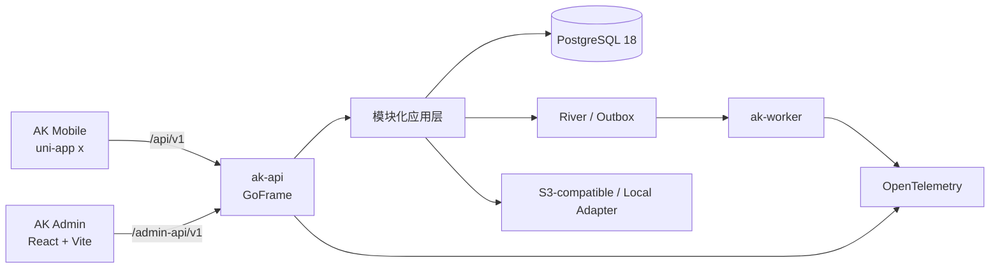

# 总体架构



## 三个产品面

### AK Mobile

使用 uni-app x、UTS/UVue 与 VDOM。业务页面通过 `ak-*` 组件、Application Use Case 与 Port 访问平台和网络能力，避免直接依赖原生 SDK 或 uView 细节。

### AK Admin

React SPA 只访问 `/admin-api/v1`。路由代码静态编译，菜单由服务端过滤，最终授权仍由 Go API 强制执行。

### AK Server

GoFrame 负责 HTTP 边界，pgx/v5 + sqlc 负责 PostgreSQL 数据访问。模块遵守：

```text
Transport → Application → Domain
Infrastructure → Application/Domain Port
```

API、Worker 与 CLI 共享代码库；内部任务使用 River，外部事件使用 Transactional Outbox。

## 契约先行

`server/openapi/openapi.yaml` 是 API 最终事实源。Admin 和 Mobile 从契约生成类型；任何接口改动必须同时更新路由、用例、数据库/权限/审计（如涉及）和测试。
