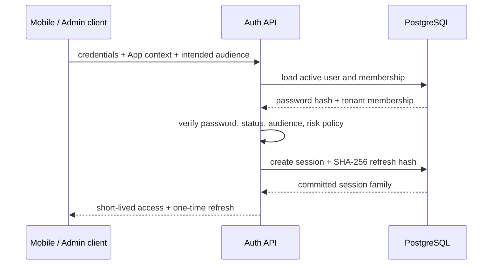
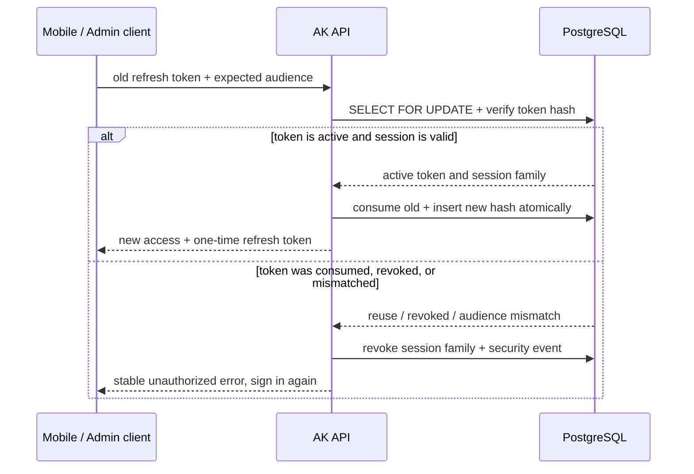
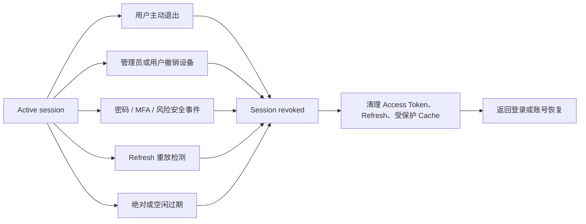

# 认证与会话

## Token 分工

| 类型          | 作用          | 客户端存储                                        | 服务端存储         |
| ------------- | ------------- | ------------------------------------------------- | ------------------ |
| Access Token  | 短期 API 身份 | Admin / Mobile 只在内存                           | 不作为长期会话事实 |
| Refresh Token | 轮换会话      | Admin Secure HttpOnly Cookie；Mobile 系统安全存储 | 仅 SHA-256 Hash    |

Access Token 使用 Ed25519/EdDSA，默认 15 分钟，并通过 `aud` 隔离 `ak-mobile`、`ak-admin` 与 `ak-api`。

## 登录如何形成会话

登录入口先确定 Mobile 或 Admin Audience。服务端验证账号、App 与租户成员关系后才创建 Session Family；明文密码和 Refresh Token 都不会写入数据库或日志。

## Refresh Rotation

每次刷新都会原子消费旧令牌并生成新令牌；同一个旧 Token 并发出现时只有一个请求能成功，后续重用会触发整条会话链撤销。

同一旧 Token 并发使用时只能一个成功。已消费 Token 再次出现会被视为重放，服务端撤销整个 Session Family 并创建安全事件。

## 会话在哪里失效

会话失效是服务端事实。客户端收到稳定的未授权结果后清理本地身份与租户相关缓存，不尝试用隐藏页面或旧快照继续授权操作。

## 客户端规则

- 401 Refresh 使用 single-flight，原请求最多重试一次。
- 403 不触发 Refresh。
- 没有幂等保证的写请求不自动重放。
- 登出、切换租户或 Session 失效后清理受保护缓存。
- Admin Refresh Token 只使用 Secure HttpOnly Cookie；Mobile Refresh Token 只进入系统安全存储。
- Access Token 不进入 localStorage、sessionStorage、IndexedDB 或普通 `uni` storage。
