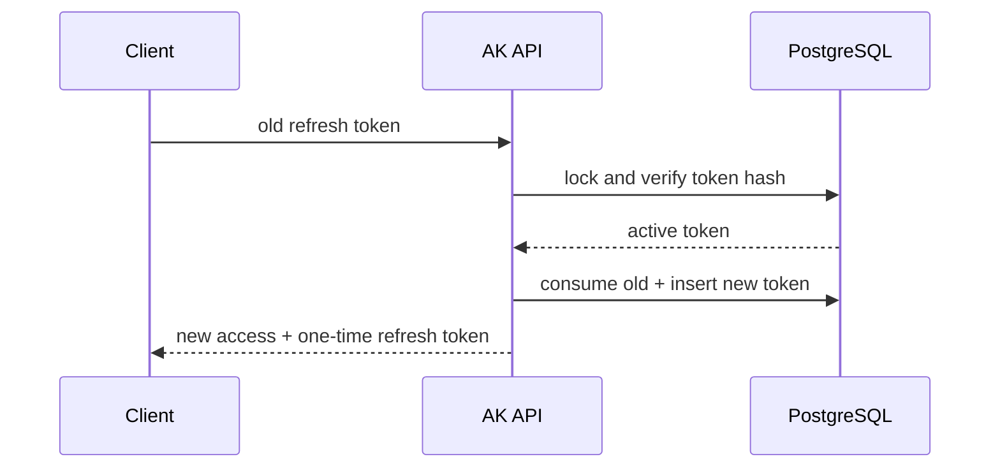

# 认证与会话

## Token 分工

| 类型          | 作用          | 客户端存储                                        | 服务端存储         |
| ------------- | ------------- | ------------------------------------------------- | ------------------ |
| Access Token  | 短期 API 身份 | Admin / Mobile 只在内存                           | 不作为长期会话事实 |
| Refresh Token | 轮换会话      | Admin Secure HttpOnly Cookie；Mobile 系统安全存储 | 仅 SHA-256 Hash    |

Access Token 使用 Ed25519/EdDSA，默认 15 分钟，并通过 `aud` 隔离 `ak-mobile`、`ak-admin` 与 `ak-api`。

## Refresh Rotation

同一旧 Token 并发使用时只能一个成功。已消费 Token 再次出现会被视为重放，服务端撤销整个 Session Family 并创建安全事件。

## 客户端规则

- 401 Refresh 使用 single-flight，原请求最多重试一次。
- 403 不触发 Refresh。
- 没有幂等保证的写请求不自动重放。
- 登出、切换租户或 Session 失效后清理受保护缓存。
