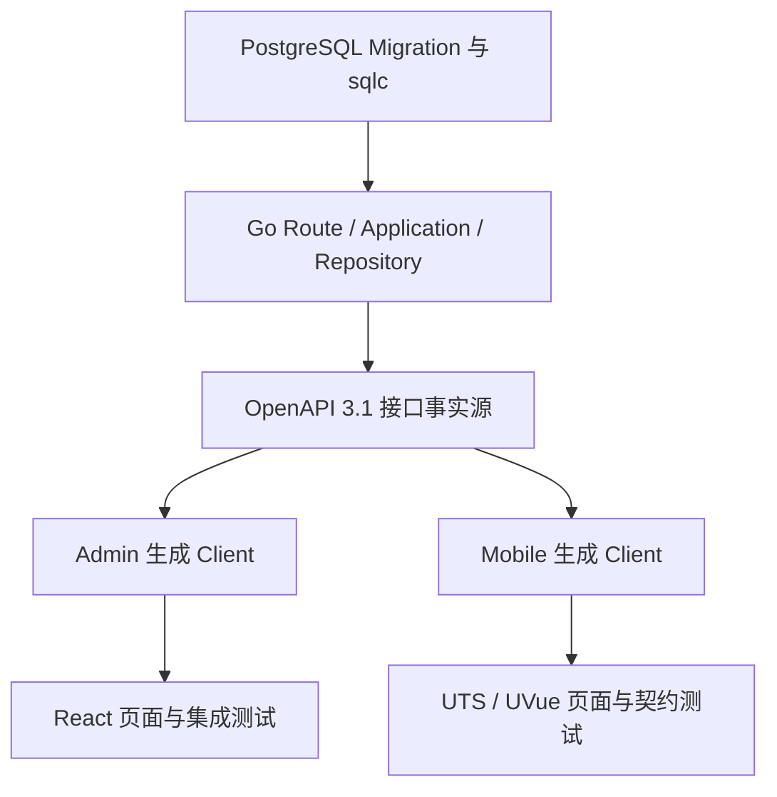
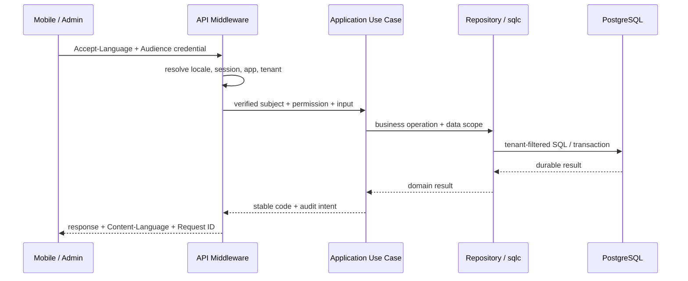

# 核心概念

AppKernia 的价值不只来自技术栈，更来自三端共同遵守的边界。

## 三端契约链

一项接口改动从数据库与服务端规则出发，经 OpenAPI 同步到两个生成客户端，再由 Admin 与 Mobile 的页面和测试共同验证。

接口改动不是只修改一个 Handler。涉及字段、权限或数据范围时，服务端实现、OpenAPI、数据库、权限 Seed、生成 Client 和集成测试必须沿这条链同步。任何一端出现“临时手写 DTO”，都可能让编译通过却在运行时漂移。

## 职责边界

| 层           | 应当负责                            | 不应承担                              |
| ------------ | ----------------------------------- | ------------------------------------- |
| Mobile       | 用户任务、设备状态、离线与平台体验  | 信任客户端声明的 tenant、role 或 user |
| Admin        | 运营工作流、表单、菜单和数据范围 UX | 用按钮隐藏替代服务端授权              |
| API / Worker | 授权、幂等、审计、任务与业务规则    | 把安全判断交给前端                    |
| PostgreSQL   | 约束、事务、租户过滤与持久化事实    | 接受未经服务层验证的开放动态执行      |

## 一次请求如何流动

客户端提供请求上下文，但可信的用户、租户、权限和数据范围都在服务端解析；SQL 层落实隔离，客户端只依据稳定状态码更新界面。

1. 客户端带上 `Accept-Language`；Mobile 还发送公开的 `X-AppID`，受保护请求携带对应 Audience 的身份凭据。
2. API 解析 Locale、Session、App 与 Tenant，从服务端身份上下文决定权限和数据范围。
3. Application 执行业务规则，Repository/sqlc 在 SQL 层落实租户过滤与事务。
4. 响应使用稳定业务错误码和 `Content-Language`；客户端只按稳定码决定状态，不解析文案。
5. 必要的写操作同步形成审计或安全事件，异步工作交给 Worker。

- [总体架构](./architecture)：Mobile、Admin、API、Worker 与 PostgreSQL 如何协作。
- [消息推送架构](./notification-architecture)：消息如何异步发布、按设备扇出、调用多厂商渠道并形成运行统计。
- [认证与会话](./authentication)：Access Token、Refresh Token 轮换与 Audience 隔离。
- [权限与多租户](./permissions-tenancy)：菜单、权限、数据范围和 SQL 过滤的职责。
- [国际化](./internationalization)：`zh-CN` / `en-US` 的统一契约。
- [安全模型](./security)：秘密、上传、日志、重试与扩展的红线。
