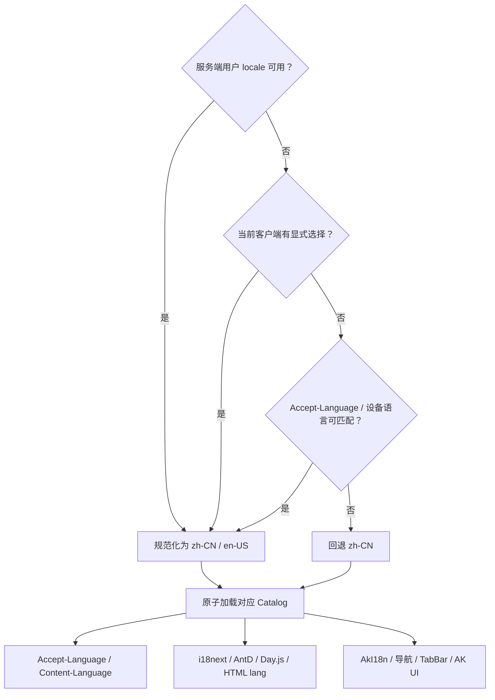

# 国际化

首发规范语言只允许 `zh-CN` 和 `en-US`，默认与最终回退都是 `zh-CN`。`zh`、`zh-Hans`、`zh_CN`、`en` 等输入别名会先规范化。

## 解析顺序

登录用户：

所有语言别名先归一化为 `zh-CN` 或 `en-US`，Catalog 完整加载后再原子切换界面；失败时保持原语言，避免半中半英。

所有请求发送 `Accept-Language`，后端返回 `Content-Language`；会因语言变化的缓存响应同时返回 `Vary: Accept-Language`。

## 错误与数据

- 业务逻辑只判断稳定错误码，不解析展示文案。
- 时间保持 RFC 3339 UTC，金额保持最小货币单位整数。
- Admin 同步 i18next、Ant Design、Day.js、HTML `lang` 与标题。
- Mobile 同步 AkI18n、导航标题、TabBar、AK UI 与后续请求。
- 两套语言包的 key 与占位符必须完全一致。

动态菜单使用稳定 `i18n_key`，业务错误使用稳定 `error.code` / `message_key`。后端返回的本地化 `message` 是展示后备，不是客户端业务判断条件。
