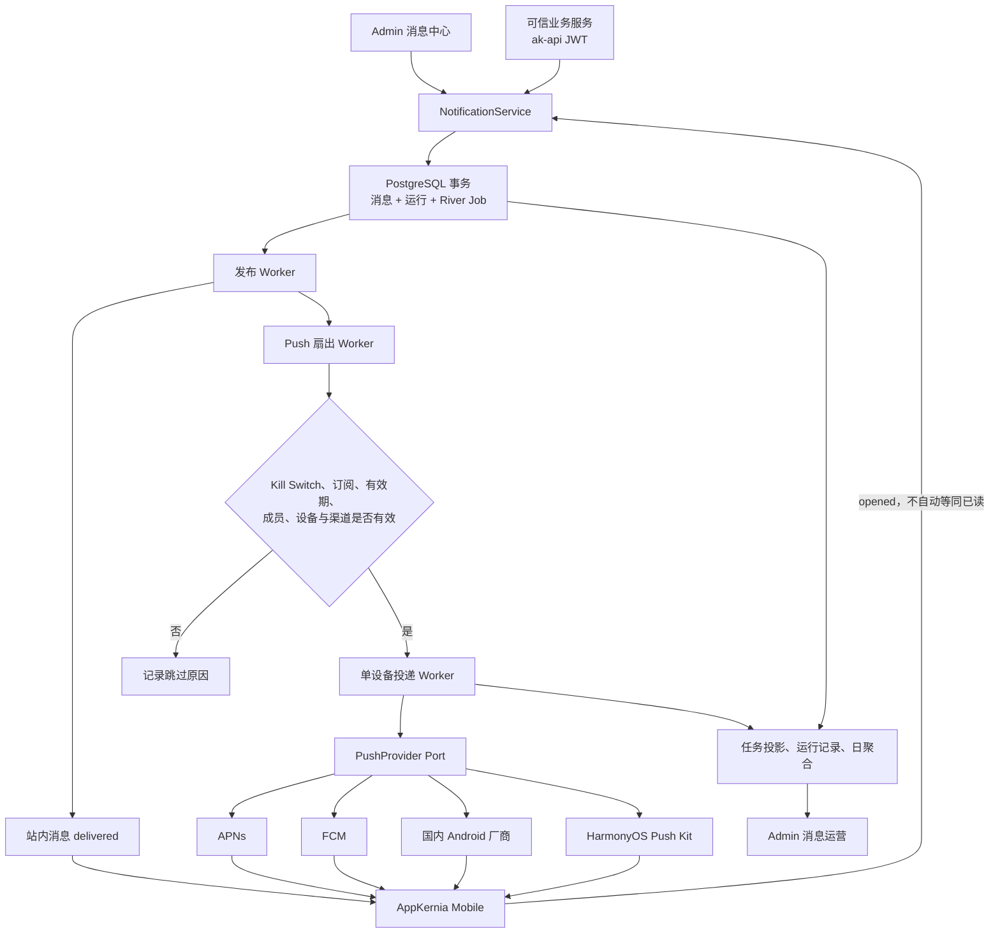

# 消息推送架构

AppKernia 的离线消息不是在 HTTP 请求中逐台发送。服务端使用 **PostgreSQL + River** 作为异步任务基础设施，并把消息、运行记录和任务入队放在同一个数据库事务中提交。

这条链路同时服务于 Admin 发布、可信业务服务提交和 Mobile 站内消息。站内消息是基础能力；用户关闭 Push、设备没有可用厂商通道或厂商发送失败时，站内消息仍然可见。

## 端到端数据流

同步请求只完成可信校验与事务提交；发布、设备扇出和厂商调用由 Worker 异步执行。业务数据与任务共用 PostgreSQL，避免双写半完成。

## 三类通知任务

| 任务类型                          | 作用                                 | 默认最大尝试 | Worker 超时 |
| --------------------------------- | ------------------------------------ | -----------: | ----------: |
| `appkernia-message-publish`       | 到点发布定时消息，更新站内收件人     |            5 |       30 秒 |
| `appkernia-push-fanout`           | 检查订阅与设备，按批次创建每设备投递 |            5 |       90 秒 |
| `appkernia-notification-delivery` | 解密单台设备 Token 并调用对应厂商    |            5 |       90 秒 |

这些任务都进入 `notifications` 队列。业务模块只依赖 `platform/jobqueue`，不直接依赖 River Client；任务类型、队列、最大尝试次数和可自动重试分类在编译期注册。

## 数据事实源

| 数据                                    | 用途                                             | 保留策略          |
| --------------------------------------- | ------------------------------------------------ | ----------------- |
| `river_job`                             | River 的实时调度状态                             | 按 River 运行策略 |
| `notify.messages` / `notify.recipients` | 消息快照、冻结收件人和站内送达事实               | 按通知域策略      |
| `notify.deliveries`                     | 每设备受理、失败、Token 失效和打开记录           | 按通知域策略      |
| `notify.message_runs`                   | 从计划、发布、扇出到投递完成的流水线             | 明细 90 天        |
| `jobs.task_runs` / `jobs.task_attempts` | 租户和 App 隔离的任务索引、尝试结果与 Trace ID   | 明细 90 天        |
| `notify.delivery_daily_metrics`         | 按 App、环境、渠道、厂商、分类和结果聚合的日统计 | 13 个月           |

任务投影不保存 River 原始 Args、完整堆栈、Token、推送载荷、密钥或厂商响应正文。需要完整调用链时，使用安全摘要中的 Trace ID 查询部署环境的可观测系统。

## 投递结果语义

| 归一结果              | 行为                                                       |
| --------------------- | ---------------------------------------------------------- |
| `accepted`            | 标记厂商已受理；不承诺设备已经展示                         |
| `invalid_token`       | 终止本次投递并立即把设备绑定标为失效                       |
| `throttled`           | 遵守 `Retry-After`，结合指数退避与抖动重试                 |
| `transient`           | 对明确瞬时错误自动重试                                     |
| `permanent`           | 不自动重试                                                 |
| `auth_config_error`   | 标记渠道故障；修复凭据并通过预检前禁止人工重试             |
| `unknown_after_write` | 不自动重放；厂商可能已受理，只能单条确认重复风险后人工处理 |

消息已经取消、过期或重复 Job 到达时，Worker 会安全 no-op。管理员重试会创建新任务并保留原任务历史，不会修改 River 原始记录。

## 安全边界

- 全局 Kill Switch、应用与环境渠道状态、用户订阅和 OS 权限共同决定是否发送 Push。
- Token 使用密文保存和 HMAC Hash 去重；凭据只写入、加密存储，Admin API 不返回明文。
- 通知点击载荷只允许版本、delivery/message ID、受控 `route_key`、不透明资源 ID 和有限路由参数。
- 不支持任意 URL、组件名、动态脚本、静默唤醒或后台任意代码执行。
- Prometheus 标签使用 App、Provider、Category 和 Result 等低基数维度，不使用用户 ID 或 Token。

## 验收口径

Mock Provider、源码编译和厂商“受理”都不等于设备真实展示。生产开启前，仍需逐渠道完成账号权益、凭据、包名或 Bundle ID、签名指纹、隐私联网行为，以及前台、后台、被终止、离线恢复和通知点击真机验收。

继续阅读[推送渠道配置](../guide/push-channels)、[消息运营工作台](../guide/notification-operations)、[通知 API](../api/mobile-notifications)和[移动端权限中心](../guide/mobile-permissions)。
