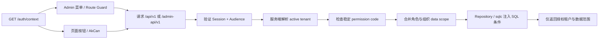

# 权限与多租户

AppKernia 把“看得见”和“做得到”分开：

- `sys.menus` 决定 Admin 导航。
- `iam.permissions.code` 是后端授权事实，例如 `iam.user.read`。
- 页面按钮只改善体验，不能替代 API 授权。
- `tenant_id` 只能来自已验证 Session Context，不能相信请求 Body 或 Query。

菜单和按钮可以提前避免无效操作，但真正的授权从会话、Audience 和租户上下文开始，最后必须落到服务端权限判断与 SQL 数据范围。

## 数据范围

角色可以使用 `all`、`tenant`、`department`、`department_tree`、`self` 或 `custom`。Repository 必须把有效范围转成 SQL 条件；禁止全量读出后在 Go 或前端过滤。

当用户同时拥有多个角色时，Application 先根据当前租户、角色有效期和组织关系计算有效范围，再交给 Repository 构造参数化 SQL。切换租户后必须清理客户端受保护缓存，避免上一租户的数据快照被错误复用。

## 两条 API 边界

| 客户端 | 唯一路由前缀    | Audience    |
| ------ | --------------- | ----------- |
| Mobile | `/api/v1`       | `ak-mobile` |
| Admin  | `/admin-api/v1` | `ak-admin`  |

同一个用户也不能拿 Admin Token 访问 Mobile-only 会话，反之亦然。
