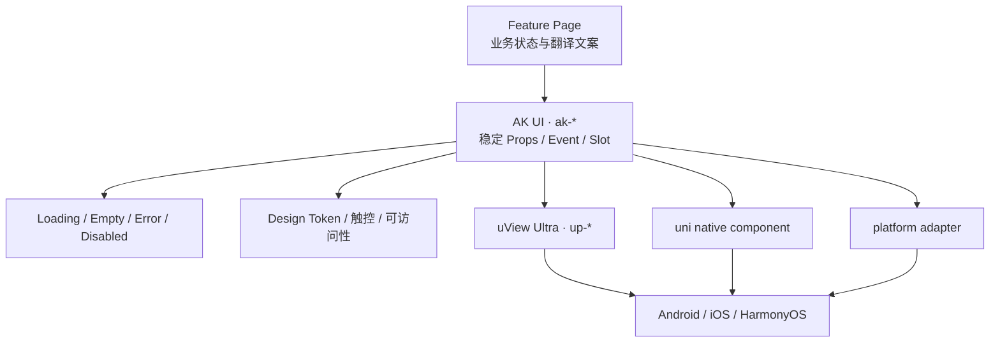

# AK Mobile 组件

业务页面只能使用 `apps/ak-mobile/components/ak-ui` 暴露的 `ak-*` 组件。AK UI 隔离视觉 Token、平台兼容、触控尺寸、事件类型和底层 uView / uni 原生实现。

页面只看到 `ak-*` 的稳定语义契约，底层库和平台差异留在适配层；因此替换实现或修复兼容性时不需要重写每个业务页面。

<strong>文档范围</strong>本节只记录当前源码中真实存在的组件。兼容矩阵里尚未实现或仍为 conditional 的 AkPicker、AkDatePicker、AkTabs 等，不会在这里写成可直接使用。

## 如何选择组件

1. 先用语义明确的 `ak-*` 组件；只有现有组件无法表达需求时才提出新增组件。
2. 页面级数据获取、权限和业务状态留在 Feature Page，不塞进纯 UI 组件。
3. 平台差异在 AK UI 或 platform adapter 收口，业务页面不直接判断一组零散平台条件。
4. 新组件先定义 Loading、Empty、Error、Disabled、长文本与双语行为，再讨论视觉细节。
5. 若需要直接使用 `up-*`，应先补齐 AK UI 适配层，而不是在业务页面形成第二套公共 API。

## Props、Event 与 Slot 约定

| 契约  | 规则                                                                        |
| ----- | --------------------------------------------------------------------------- |
| Props | 使用稳定、可序列化的 UTS 类型；可见文案由页面翻译后传入，不在组件内查业务键 |
| Event | 事件名描述已经发生的语义动作；Loading/Disabled 时不重复触发                 |
| Slot  | 只为明确的内容扩展点开放；不得绕过组件状态、间距和可访问性约束              |
| Model | 双向状态必须说明更新时机、失败回滚和平台差异                                |
| Style | 优先使用 Design Token 与页面 override，不把任意 CSS 变成公共输入            |

组件详情页中的 Props/Event/Slot 表以当前源码为准。新增字段必须同步组件实现、示例、双语说明、平台证据和检查脚本。

## 当前实现

| 组件                                | 用途                               | 状态   |
| ----------------------------------- | ---------------------------------- | ------ |
| [`ak-scanner`](./scanner)           | 二维码、条形码、事件与可信网页处理 | 已实现 |
| [`ak-button`](./button)             | 主、次、危险操作与加载态           | 已实现 |
| [`ak-text-field`](./text-field)     | 标签、输入、密码、禁用与错误       | 已实现 |
| [`ak-card`](./layout-status)        | 通用内容容器                       | 已实现 |
| [`ak-cell-list`](./layout-status)   | 设置/个人中心列表容器              | 已实现 |
| [`ak-empty-state`](./layout-status) | 空状态与下一步动作                 | 已实现 |
| [`ak-loading`](./layout-status)     | 局部加载提示                       | 已实现 |
| [`ak-status-view`](./layout-status) | Loading / Empty / Error 等状态编排 | 已实现 |
| [`ak-modal`](./modal-switch)        | 高风险确认                         | 已实现 |
| [`ak-switch`](./modal-switch)       | 布尔设置                           | 已实现 |
| [`ak-icon`](./icons-theme)          | 受控语义图标                       | 已实现 |
| [`ak-back-button`](./icons-theme)   | 安全返回与 fallback                | 已实现 |
| [`ak-theme-root`](./icons-theme)    | 主题根容器                         | 已实现 |

## 通用规则

- 所有可见文案由页面通过 `AkI18n` 翻译后传入；组件默认值不硬编码展示语言。
- 触控目标至少 44×44。
- Loading / Disabled 时必须阻止重复提交。
- 状态不能只靠颜色表达。
- 组件源码通过 easycom 以 `ak-*` 使用，业务页面不得直接写 `up-*`。
- 真正的平台可用性以 Android、iOS、HarmonyOS 对应构建和设备证据为准。

## 平台证据怎么读

- **静态检查通过**：类型、导入和约束匹配，不等于任一平台已经编译。
- **平台编译通过**：对应编译器完成，不等于安装、启动或交互通过。
- **模拟器通过**：只覆盖标注的 OS、版本与设备模型，不等于真机。
- **真机通过**：必须记录平台、系统版本、设备、构建类型与截图/日志索引。
- **HarmonyOS 声明**：只有 DevEco/HBuilderX 对应产物和真实设备证据齐全时才标为运行通过。
