# AppKernia 数据库 Schema 说明

> 目标数据库：PostgreSQL 18.x（初始 18.4）  
> 核心迁移：`000001`～`000005`  
> 可选 Billing：`000006`  
> 核心表：51 张；启用 Billing 后共 57 张

本文件解释数据域、关系和强约束。字段、索引、Check、外键和触发器的最终事实源是 `db/migrations/*.sql`。

PostgreSQL 仍是完整业务数据库。`akone` 的 SQLite standalone 使用 `server/internal/platform/sqlite/schema.sql` 独立描述首期本地能力，不转换本目录 SQL；默认文件为二进制同目录的 `data/appkernia.db`。SQLite 首期覆盖 IAM 会话和 Dashboard 所需数据，队列及其他业务表不在此能力内，详见 ADR-0034。

---

## 1. Schema 分区

| Schema | 职责 | 核心/可选 |
|---|---|---|
| `iam` | 用户、租户、认证、会话、角色、权限、MFA、风控 | 核心 |
| `org` | 组织机构、岗位、用户组织归属 | 核心 |
| `sys` | 菜单、配置、字典、地区、API Client、幂等、Webhook、模块注册 | 核心 |
| `storage` | 对象存储文件、上传会话、分片和业务引用 | 核心 |
| `notify` | 消息、收件人、通知模板、渠道投递、推送设备 | 核心 |
| `jobs` | 定时计划、运行历史、Outbox/Inbox | 核心 |
| `audit` | 操作、登录和安全事件 | 核心 |
| `billing` | 支付、退款、钱包、账本、提现 | 可选 |

River 自有任务表由 River 官方迁移管理，不放入 AK 业务迁移。

---

## 2. 主要关系图

```mermaid
erDiagram
    IAM_TENANTS ||--o{ IAM_TENANT_MEMBERS : contains
    IAM_USERS ||--o{ IAM_TENANT_MEMBERS : joins
    IAM_USERS ||--|| IAM_USER_CREDENTIALS : has
    IAM_USERS ||--o{ IAM_OAUTH_ACCOUNTS : links
    IAM_USERS ||--o{ IAM_DEVICES : owns
    IAM_USERS ||--o{ IAM_SESSIONS : opens
    IAM_SESSIONS ||--o{ IAM_REFRESH_TOKENS : rotates

    IAM_TENANTS ||--o{ IAM_ROLES : defines
    IAM_TENANT_MEMBERS ||--o{ IAM_USER_ROLES : receives
    IAM_ROLES ||--o{ IAM_USER_ROLES : assigned
    IAM_ROLES ||--o{ IAM_ROLE_PERMISSIONS : grants
    IAM_PERMISSIONS ||--o{ IAM_ROLE_PERMISSIONS : included

    IAM_TENANTS ||--o{ ORG_UNITS : owns
    ORG_UNITS ||--o{ ORG_UNITS : parent
    IAM_TENANT_MEMBERS ||--o{ ORG_USER_UNITS : assigned
    ORG_POSITIONS ||--o{ ORG_USER_POSITIONS : assigned
    IAM_ROLES ||--o{ IAM_ROLE_SCOPE_UNITS : scoped
    ORG_UNITS ||--o{ IAM_ROLE_SCOPE_UNITS : limits

    IAM_ROLES ||--o{ SYS_ROLE_MENUS : sees
    SYS_MENUS ||--o{ SYS_ROLE_MENUS : assigned
    IAM_PERMISSIONS o|--o{ SYS_MENUS : gates

    IAM_TENANTS ||--o{ STORAGE_FILES : owns
    STORAGE_FILES ||--o{ STORAGE_FILE_USAGES : referenced
    STORAGE_UPLOAD_SESSIONS ||--o{ STORAGE_UPLOAD_PARTS : contains

    IAM_TENANTS ||--o{ NOTIFY_MESSAGES : owns
    NOTIFY_MESSAGES ||--o{ NOTIFY_RECIPIENTS : targets
    IAM_TENANT_MEMBERS ||--o{ NOTIFY_RECIPIENTS : receives
    NOTIFY_MESSAGES ||--o{ NOTIFY_DELIVERIES : emits

    JOBS_SCHEDULES ||--o{ JOBS_SCHEDULE_RUNS : executes
```



Mermaid 名称为可读化表示；实际物理表使用 `schema.table`。

---

## 3. 核心设计原则

### 3.1 身份与租户分离

`iam.users` 是全局身份，用户通过 `iam.tenant_members` 加入一个或多个租户。这样同一个邮箱/手机号只对应一个用户，又能在不同租户拥有不同成员状态、角色、组织和显示名。

### 3.2 认证数据分离

- 密码：`iam.user_credentials`。
- 密码历史：`iam.password_history`。
- OAuth/OIDC：`iam.oauth_accounts`。
- 设备：`iam.devices`。
- 登录会话：`iam.sessions`。
- Refresh Token 家族：`iam.refresh_tokens`。
- OTP/重置挑战：`iam.verification_challenges`。
- MFA：`iam.mfa_factors`、`iam.mfa_recovery_codes`。

密码、Refresh Token、验证码、API Secret 和推送 Token 均不得明文入库。

### 3.3 授权与导航分离

- `iam.permissions`：后端授权事实。
- `iam.roles`：租户角色和数据范围。
- `iam.role_permissions`：角色权限。
- `sys.menus`：React 管理后台导航元数据。
- `sys.role_menus`：角色菜单可见性。

菜单是否可见不等于 API 是否有权访问。

### 3.4 树结构

角色、组织和菜单使用邻接表 `parent_id`。组织和角色同时使用复合外键约束父节点属于同一租户。查询后代使用 Recursive CTE；不保存冗余 `level/tree/path` 字符串。

### 3.5 多租户关系

安全敏感关系优先使用 `(tenant_id, id)` 复合外键。例如：

- 会话必须属于该租户成员。
- 用户角色必须把同租户成员关联到同租户角色。
- 组织归属必须引用同租户成员和组织。
- 文件使用记录必须引用同租户文件。
- 消息收件人必须是同租户成员。

### 3.6 软删除

用户、角色、组织、文件等需要历史保留的表带 `deleted_at`。可复用业务编码使用部分唯一索引，只约束未删除数据。审计和账本不使用软删除语义，而是不可变或归档。

---

## 4. 表目录

### 4.1 IAM

| 表 | 租户范围 | 主要职责 | 关键约束 |
|---|---|---|---|
| `iam.tenants` | 全局 | 租户主体、状态、套餐和设置 | `code` 唯一 |
| `iam.users` | 全局 | 用户身份和基础资料 | username/email/mobile 活跃记录部分唯一；UUIDv7 |
| `iam.user_credentials` | 全局 | Argon2id 密码与锁定状态 | 每用户一行；算法和版本受限 |
| `iam.password_history` | 全局 | 防止近期密码复用 | 按用户和时间索引 |
| `iam.oauth_accounts` | 全局 | 第三方账号绑定 | `(provider, subject)` 唯一 |
| `iam.tenant_members` | 租户 | 用户与租户成员关系 | `(tenant_id,user_id)` 主键 |
| `iam.roles` | 租户 | 角色、层级、数据范围 | 活跃角色 code 租户内唯一；父角色同租户 |
| `iam.permissions` | 全局 | 稳定权限目录 | `code` 全局唯一 |
| `iam.user_roles` | 租户 | 成员角色分配 | 成员和角色复合外键；支持有效期 |
| `iam.role_permissions` | 租户 | 角色权限授权 | 角色同租户；权限为全局目录 |
| `iam.devices` | 全局 | 用户设备指纹和信任状态 | `(user_id,device_key)` 唯一 |
| `iam.login_failure_states` | HMAC 保护范围 | Admin 登录失败滑动窗口 | 只存 32 字节 HMAC 范围与有界次数，30 分钟后失效 |
| `iam.interactive_captcha_challenges` | HMAC 保护范围 | Admin 登录及 Mobile 短信发送前的短时交互式验证码 | 保存固定 `captcha_type` 与不透明证明 Token 的 SHA-256；5 分钟过期、最多 5 次尝试、成功后一次性消费，同一范围仅一个活动挑战 |
| `iam.sessions` | 可选租户 | 可撤销登录会话 | audience、绝对过期、租户成员约束 |
| `iam.refresh_tokens` | 会话 | Refresh Token 轮换链 | 只存 32 字节哈希；哈希唯一 |
| `iam.verification_challenges` | 全局/App | OTP、邮箱/手机验证、密码重置和账号删除 | 目标存哈希/Hint，验证码存哈希、尝试次数和过期时间；`account_delete` 元数据绑定 App 与用户 |
| `iam.mfa_factors` | 全局 | TOTP/WebAuthn 因子 | 因子材料与类型匹配 |
| `iam.mfa_recovery_codes` | 全局 | MFA 恢复码 | 只存哈希；哈希唯一 |
| `iam.block_rules` | 全局/租户 | IP、CIDR、用户、设备和标识风控规则 | subject/action/status Check |
| `iam.role_scope_units` | 租户 | 自定义角色组织数据范围 | 同租户角色与组织复合外键 |
| `iam.user_preferences` | App | 用户语言、主题与通知偏好 | `(app_id,user_id)` 主键；App 成员删除时级联清理 |

### 4.2 Organization

| 表 | 租户范围 | 主要职责 | 关键约束 |
|---|---|---|---|
| `org.units` | 租户 | 公司、事业部、部门、团队树 | 父节点同租户；活跃 code 唯一 |
| `org.positions` | 租户 | 岗位目录 | 活跃 code 租户内唯一 |
| `org.user_units` | 租户 | 成员组织归属 | 同租户成员/组织；每成员最多一个主组织 |
| `org.user_positions` | 租户 | 成员岗位及可选所属组织 | 同租户关系；每成员最多一个主岗位 |

### 4.3 System

| 表 | 租户范围 | 主要职责 | 关键约束 |
|---|---|---|---|
| `sys.modules` | 全局 | 8 个领域模块的编译期登记、双语语义键、统一构建版本和能力元数据 | code 唯一；种子精确同步并清理目录外记录；不是运行时二进制插件表 |
| `sys.menus` | 全局/租户 | React 管理端目录、页面和外链导航 | global/tenant code 部分唯一；页面字段 Check |
| `sys.role_menus` | 租户 | 角色可见菜单 | 同租户角色复合外键 |
| `sys.config_items` | 全局/租户 | 类型化动态配置与秘密密文 | global/tenant key 部分唯一；秘密不能公开 |
| `sys.dict_types` | 全局/租户 | 字典类型 | global/tenant code 部分唯一 |
| `sys.dict_items` | 字典 | 本地化字典项 | `(type,value,coalesce(locale,''))` 唯一 |
| `sys.regions` | 全局 | 国家/省市区等地区编码 | code 主键；父编码自引用；手工维护记录受版本锁和软删除保护，种子同步不得覆盖 |
| `sys.api_clients` | 租户 | 机器客户端身份及可选用户委托 | client_id 全局唯一；CIDR Allowlist；`bound_user_id` 复合外键保证绑定同租户成员 |
| `sys.api_client_secrets` | Client | 可轮换客户端密钥 | 只存 32 字节哈希 |
| `sys.api_client_permissions` | 租户 | API Client 权限 | 同租户 Client 复合外键 |
| `sys.idempotency_keys` | 租户 | 可重试写接口结果缓存 | identity+key 唯一；请求哈希防冲突 |
| `sys.webhook_endpoints` | 租户 | Webhook 目标、事件和签名秘密 | 密文 Secret、超时和重试限制 |
| `sys.webhook_deliveries` | Endpoint | Webhook 交付状态和响应摘要 | endpoint+event 唯一 |
| `sys.mobile_releases` | 全局 | Android/iOS/Harmony 的受控发布与升级策略 | 每平台/包类型至多一条 active；双语发布说明；乐观锁；`uni_app_x` 禁止 WGT，内部原生包仅允许 Android APK |

### 4.3.1 App

| 表 | 租户范围 | 主要职责 | 关键约束 |
|---|---|---|---|
| `app.applications` | 租户 | App 身份、状态和移动运行时范围 | `(tenant_id,id)` 复合唯一；manifest AppID 配置后不可变 |
| `app.application_share_bindings` | App | 绑定可复用分享平台身份 | Provider 稳定枚举；独立乐观锁 |
| `app.application_scanner_configs` | App | 扫码可信 WebView 开关与域名白名单 | `(tenant_id,app_id)` 主外键；最多 100 条；启用时非空；独立乐观锁 |

扫码域名只保存服务端规范化后的 ASCII/Punycode DNS 规则。允许精确域名与 `*.` 通配符；通配符不匹配根域，协议、路径、凭据、IP、localhost、非 443 端口和公共后缀通配符均不得入库。

### 4.4 Storage

| 表 | 租户范围 | 主要职责 | 关键约束 |
|---|---|---|---|
| `storage.files` | 租户/App | 对象元数据、哈希、扫描和可见性 | 对象地址唯一；Mobile 文件可记录 `app_id`，仅独占且无引用对象允许删除 |
| `storage.upload_sessions` | 租户/App | 预签名/分片上传生命周期 | 上传用户必须是租户成员；Mobile 会话可记录 `app_id`；过期时间 |
| `storage.upload_parts` | Session | 分片 ETag、大小和校验和 | `(session,part_number)` 主键 |
| `storage.file_usages` | 租户 | 文件与业务实体引用关系 | 文件与使用记录同租户；引用唯一 |

### 4.5 Notification

| 表 | 租户范围 | 主要职责 | 关键约束 |
|---|---|---|---|
| `notify.templates` | 全局/租户 | 邮件、短信、Push、Webhook 模板 | code+channel+locale 范围内唯一 |
| `notify.messages` | 租户 | 站内公告、私信、营销和安全消息 | 状态机、发布和过期时间 |
| `notify.recipients` | 租户 | 消息收件人、送达、已读、归档 | 收件人必须为同租户成员 |
| `notify.deliveries` | 租户 | 外部渠道投递任务和结果 | 目标密文 + Keyed HMAC + Hint；消息/用户同租户 |
| `notify.push_devices` | 全局 | APNs/FCM/HMS Token 密文 | provider+token_hash 唯一；设备属于用户 |

### 4.6 Jobs

| 表 | 租户范围 | 主要职责 | 关键约束 |
|---|---|---|---|
| `jobs.schedules` | 全局/租户 | 管理端可配置定时计划 | handler 必须代码注册；code 范围内唯一 |
| `jobs.schedule_runs` | Schedule | 定时/手动执行历史 | 可关联 River Job ID；状态 Check |
| `jobs.outbox_events` | 全局/租户 | 事务 Outbox | 未发布事件按 available_at 领取 |
| `jobs.inbox_events` | Consumer | 外部事件幂等消费记录 | `(consumer,event_id)` 主键 |

### 4.7 Audit

| 表 | 租户范围 | 主要职责 | 关键约束 |
|---|---|---|---|
| `audit.operation_logs` | 全局/租户/App | 管理和敏感业务操作审计 | Mobile Session 自动投影 `app_id`；Agent 委托同时记录 `api_client_id` 与有效 `user_id`；request/trace/resource 索引；内容必须脱敏 |
| `audit.login_events` | 全局/租户 | 登录成功、失败和阻断事件 | 登录标识只存哈希与 Hint |
| `audit.security_events` | 全局/租户 | Token 重放、越权尝试等安全事件 | 严重级别和未解决索引 |
| `audit.privacy_erasure_events` | App | 不含用户标识的账号清除证明 | 固定动作码 `iam.user.delete_self`，只记录范围、结果、数量和时间 |
| `audit.privacy_erasure_objects` | 清除事件 | 对象存储幂等清除任务状态 | 对象定位唯一；pending/succeeded/failed 状态与尝试次数受约束 |

### 4.8 Optional Billing

| 表 | 租户范围 | 主要职责 | 关键约束 |
|---|---|---|---|
| `billing.payment_orders` | 租户 | 统一支付业务单 | 业务单号租户内唯一；金额为最小单位 |
| `billing.payment_transactions` | Order | 支付网关交易尝试 | 交易号和网关流水唯一 |
| `billing.refunds` | Order | 退款申请和结果 | 退款号唯一；正金额 |
| `billing.wallet_accounts` | 租户 | 用户资产账户快照 | 用户必须是租户成员；乐观锁 |
| `billing.wallet_ledger_entries` | Wallet | 不可变余额/积分流水 | 幂等键唯一；余额前后数学约束 |
| `billing.withdrawals` | Wallet | 提现申请和处理 | 加密收款目标；实付额生成列 |

---

## 5. 关键不变量

### 5.1 Refresh Token

- `token_hash` 固定 32 字节并唯一。
- 原始 Token 仅返回给客户端一次。
- `parent_token_id`/`replaced_by_token_id` 构成轮换链。
- `consumed_at` 已有值的 Token 再次出现即视为重放。
- 重放处理由应用事务撤销整条 Session，而非只撤销单个 Token。

### 5.2 角色数据范围

- `iam.roles.data_scope` 决定范围算法。
- `custom` 时读取 `iam.role_scope_units`。
- `department_tree` 通过 Recursive CTE 计算后代组织。
- SQL 查询在 Repository 入口合并用户有效角色范围。

### 5.3 文件状态

```text
pending → ready
pending → quarantined
ready → deleted
quarantined → ready        仅人工/重新扫描确认
```

通用业务实体只能引用 `status='ready'` 且 `scan_status IN ('clean','skipped')` 的文件。反馈附件更严格，仅接受 `scan_status='clean'`，禁止 skipped。

### 5.4 消息状态

```text
draft → scheduled → published
  └──────────────→ cancelled
```

发布后为每个目标用户建立 `notify.recipients`。站内消息最终状态来自数据库，WebSocket 只是提示客户端刷新。

### 5.5 钱包

- `wallet_accounts` 是当前快照。
- `wallet_ledger_entries` 是事实流水，不 UPDATE/DELETE。
- 同一业务通过 `(wallet_account_id,idempotency_key)` 去重。
- 账户快照和流水必须在同一事务中更新/插入。
- 冲正通过反向补偿流水，不修改原流水。

---

## 6. 索引策略

- 活跃软删除实体：部分唯一索引和部分查询索引。
- 用户/组织/文件名模糊搜索：`pg_trgm + GIN`。
- 时间线：`(tenant_id, created_at DESC)` 或 `(user_id, occurred_at DESC)`。
- 待处理队列：对 `status/available_at/next_attempt_at` 建部分索引。
- 大型审计表进入规模期后按月对 `occurred_at` 分区。
- 对 JSONB 不默认建通用 GIN；只有明确查询路径和基准后再建表达式索引。

---

## 7. 数据库角色建议

生产环境至少分离：

| 角色 | 权限 |
|---|---|
| `ak_migrator` | DDL、迁移、扩展安装；不用于应用运行 |
| `ak_app` | 业务表 DML、序列/函数执行；不能 DDL |
| `ak_readonly` | 报表/排障只读，敏感表按需限制 |
| `ak_audit_reader` | 审计查询；不能修改审计数据 |

对审计和钱包流水，应用运行角色不授予 `UPDATE/DELETE`；必要维护使用受控的独立管理员流程。

---

## 8. 迁移文件

```text
db/migrations/
├── 000001_extensions_and_schemas.up.sql
├── 000001_extensions_and_schemas.down.sql
├── 000002_iam.up.sql
├── 000002_iam.down.sql
├── 000003_org_and_scope.up.sql
├── 000003_org_and_scope.down.sql
├── 000004_system_and_storage.up.sql
├── 000004_system_and_storage.down.sql
├── 000005_notifications_jobs_audit.up.sql
├── 000005_notifications_jobs_audit.down.sql
├── 000006_billing_optional.up.sql
└── 000006_billing_optional.down.sql
```

`000006` 不属于 AK Core 默认部署。支付/钱包需求未确认前，不执行该迁移。

---

## 9. Agent 建库验收

Agent 在首次实现时必须在真实 PostgreSQL 18 容器中提供证据：

1. `000001`～`000005` 空库 Up 成功。
2. 逆序 Down 成功，再次 Up 成功。
3. 51 张核心表、索引、外键、Check 和触发器数量符合迁移。
4. 跨租户复合外键拒绝错误关联。
5. username/email/mobile 并发唯一性测试通过。
6. Refresh Token Hash 唯一和长度约束生效。
7. 组织/角色父节点跨租户被拒绝。
8. 字典/模板 `NULL locale` 也能正确唯一。
9. 文件引用跨租户被拒绝。
10. Billing 单独 Up/Down，不影响 Core。

## 国际化数据约束

- 规范语言代码：`zh-CN`、`en-US`；默认和最终回退为 `zh-CN`。数据库字段保持 `varchar(32)`，以便以后新增语言，但写入前必须经过应用层 allowlist/规范化。
- `iam.users.locale` 是登录用户跨设备偏好的事实源。
- `sys.dict_items.locale` 与 `notify.templates.locale` 已支持同一业务 code/value 的多语言版本。
- 内置菜单的数据库 `title` 保存简体中文回退；API 同时返回由菜单 code 派生或 Seed 指定的 `i18n_key`，Admin 优先本地翻译。
- 审计、任务、Outbox 和安全事件保存稳定 code/template key 与参数；不把某一种语言的成品文案作为唯一事实。
- 新业务若有可编辑的多语言内容，应建立显式 `<entity>_translations(entity_id, locale, ...)` 表及 `(entity_id, locale)` 唯一约束；禁止无 Schema 的任意 JSONB 翻译对象。
- 所有 locale 相关查询必须测试目标语言、`zh-CN` 回退和租户边界。

## Help and feedback (migration 000027)

- `content.pages` adds reserved `faq` and `contact-support` page types. Existing matching slugs are promoted without replacing revisions; missing identities are backfilled for existing Apps and created by the application trigger for new Apps. Drafts stay private. The `about-us` contract is unchanged.
- `app.feedbacks` stores tenant/App/user ownership, description, optional contact, installed version/platform, request hash/idempotency key, lock version and timestamps. `pending`, `processing`, `resolved` are fixed protocol states, not dictionary options.
- `app.feedback_attachments` links at most three ordered storage images; `app.feedback_replies` and `app.feedback_events` append reply/processing history. Replies are not edited in place. Composite foreign keys and all repository queries retain tenant and App scope.
- `storage.upload_sessions.purpose=feedback` and file metadata `purpose=feedback` isolate feedback from avatar completion, ordinary file APIs and public content assets. Private images are excluded from cross-owner storage deduplication. Source names/URLs, descriptions and contact values are not audit payloads.
- The minute-based Worker reaps expired unattached uploads in bounded locked batches. Attached images remain referenced through `storage.file_usages`. App account erasure removes feedback/usages and reuses existing object-erasure jobs. Rollback removes feedback records and permissions, preserves CMS page content as `custom`, and preserves screenshot hashes as metadata before restoring general deduplication.

## 000028：公开 H5 配置

`app.application_public_web_configs`：tenant_id/app_id 主键，enabled/apk_enabled 默认 false，promotion_enabled 默认 true，lock_version 乐观锁；App 外键与 updated_at 触发器。`app.application_public_web_translations`：按 App/规范 locale 保存公开名称、介绍及下载推广标题、说明和按钮文字；推广文案为空时 H5 使用内置双语回退。`app.application_store_listings` 新增 nullable platform 稳定枚举与 web_url，保留 Scheme/启用/优先级；禁止依名称自动推断。公开读取检查 active App 和 published 内容；配置写入锁定 App 行、版本比较、子表与审计同一事务。
