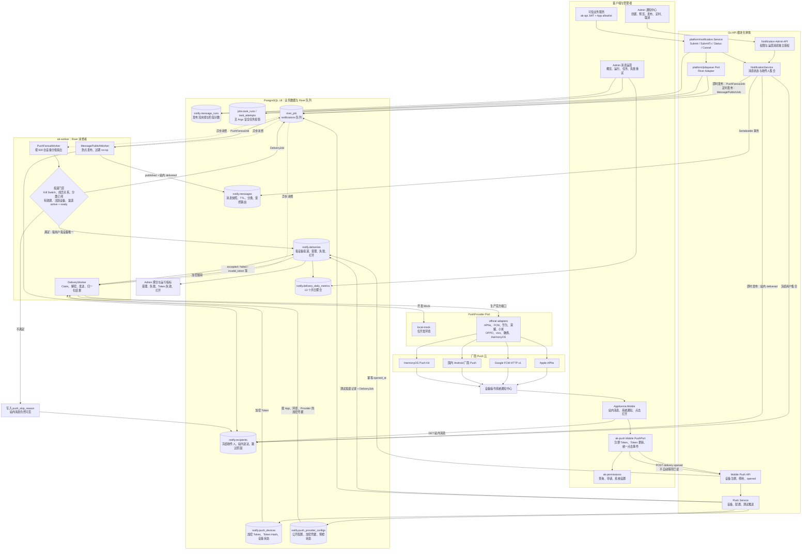

# AppKernia App 消息推送架构

> 现状快照：2026-08-29。本文描述当前仓库已经实现的消息发布、站内消息、离线 Push、任务投影、运营可观测、M2M 提交、重试与打开统计链路，不把 Mock、厂商受理或静态测试表述为设备真实展示。

## 1. 结论

AppKernia 后端使用 **River + PostgreSQL** 作为异步任务队列。管理端发布接口只负责校验权限、冻结收件人、更新消息状态，并在同一个 PostgreSQL 事务中插入 River Job；它不会在 HTTP 请求中逐台调用 APNs、FCM 或国内厂商接口。

当前共有三类 Push 相关任务，统一进入 `notifications` 队列：

| River Job | 作用 | 触发方式 |
|---|---|---|
| `appkernia-message-publish` | 到点发布定时消息 | 创建消息发布事务时按 `scheduled_at` 入队 |
| `appkernia-push-fanout` | 检查订阅和设备，为每台有效设备创建投递 | 即时发布或定时发布完成后入队 |
| `appkernia-notification-delivery` | 解密单台设备 Token/载荷并调用对应厂商 | 扇出任务为每台设备创建，测试推送也直接创建 |

River Job 与业务状态共用 PostgreSQL，并通过 `InsertTx` 与消息、收件人或投递记录在同一事务提交，避免出现“业务数据已提交但任务未入队”或相反的半完成状态。当前 Worker 为 `notifications` 队列配置 8 个并发 Worker；单个扇出任务最多读取 500 台设备，达到上限后通过游标续投下一批。

业务模块通过 `platform/jobqueue` 入队，不再依赖 River Client；可信内部调用和 M2M API 通过 `platform/notification.Service` 提交通知。`river_job` 是实时调度事实源，`jobs.task_runs/task_attempts` 是不含 Args 和敏感载荷的长期业务投影，`notify.message_runs` 则记录整条消息流水线。

## 2. 当前架构图

## 3. 发布时序

### 即时消息

1. Admin 调用发布接口；后端检查 `notify.message.publish` 或 `notify.notice.publish`。`news_operations` 还必须具备 `notify.operations.publish`。
2. 在 Serializable 事务中锁定消息、冻结当前有效收件人、把消息改为 `published`，并把站内收件人状态改为 `delivered`。
3. 同一事务插入唯一 `PushFanoutJob` 后立即返回 HTTP 200；后续离线推送不占用发布请求。
4. Fanout Worker 检查全局开关、消息有效期、成员关系、用户总开关、分类订阅、活跃设备和厂商配置。
5. 每台满足条件的设备创建一条唯一 Push Delivery 和一个 `DeliveryJob`；重复 Job 通过数据库唯一约束与 River `ByArgs` 去重安全 no-op。
6. Delivery Worker 调用 Provider Adapter，并把结果归一写回 `notify.deliveries`。

### 定时消息

定时发布先创建带 `ScheduledAt` 的 `MessagePublishJob`。到点后 Publish Worker 再把消息改为 `published`、更新站内收件人并创建 `PushFanoutJob`；消息已取消、不是 scheduled 状态或已经过期时安全 no-op。

### 测试推送

Admin 测试推送只允许选择当前 App 已注册且与配置 Provider 一致的设备，不能直接填写原始 Token。接口创建一条 `pending` Delivery 和 `DeliveryJob` 后返回 HTTP 202，实际调用仍由同一个 Delivery Worker 异步执行。

## 4. 投递状态与重试语义

| Provider 归一结果 | 当前处理 |
|---|---|
| `accepted` | Delivery 标记 `sent`，记录 `accepted_at` 和厂商消息 ID；仅表示厂商受理，不代表设备已展示 |
| `invalid_token` | Delivery 失败，并立即把对应 `push_devices` 标记为 `invalid` |
| `throttled` / `transient` | 根据厂商 `Retry-After`、指数退避和稳定抖动 `JobSnooze`，最多 5 次 |
| `auth_config_error` | Delivery 失败，并把当前 App/环境/Provider 配置标记为 `faulted` |
| `permanent` | 不自动重试 |
| `unknown_after_write` | 标记 `manual_review`，不自动重放，避免重复通知 |
| 消息取消或过期 | Provider 写出前标记 `cancelled`，不发送 |

系统通知点击后，客户端单独调用 `opened` 接口并幂等记录 `opened_at`；它不会自动把站内消息标记为已读。

## 5. 当前本地运行态

2026-08-29 对 `appkernia-news-demo` 的 API/Worker 容器检查结果：

- `ak-worker` 正在运行，River `notifications` 消费者已经注册。
- 容器未设置 `AK_PUSH_ENABLED`，配置默认值为 `false`。Fanout Worker 会把收件人的 Push 跳过原因记为 `provider_unavailable`，不会读取 Token，也不会创建新的 Push Delivery。
- 容器未设置 `AK_PUSH_ADAPTER`；开发环境默认使用 `local-mock`。即使打开 Push Kill Switch，也只会走 Mock，除非显式改为 `official`。
- 因此，“异步队列能力已经实现并运行”与“本地当前会调用真实厂商”是两件事；后者当前为否。

启用真实发送至少同时要求：

1. `AK_PUSH_ENABLED=true`；
2. 非开发环境默认或显式设置 `AK_PUSH_ADAPTER=official`；
3. 对应 App、环境和 Provider 配置为 `active`，且最近预检状态为 `ready`；
4. 用户订阅、活跃设备 Token、厂商账号权益和生产凭据均有效。

## 6. 代码索引

- River Job 类型：[notificationadmin/domain/model.go](../../server/internal/modules/notificationadmin/domain/model.go)
- 发布事务与队列写入：[notificationadmin/repository/postgres.go](../../server/internal/modules/notificationadmin/repository/postgres.go)
- 定时发布与设备扇出：[notificationadmin/worker/push_fanout_worker.go](../../server/internal/modules/notificationadmin/worker/push_fanout_worker.go)
- 单设备投递、结果和重试：[notificationadmin/worker/delivery_worker.go](../../server/internal/modules/notificationadmin/worker/delivery_worker.go)
- Worker 并发和 Adapter 选择：[cmd/ak-worker/main.go](../../server/cmd/ak-worker/main.go)
- Provider 官方发送适配器：[push/provider/sender.go](../../server/internal/modules/push/provider/sender.go)
- 设备注册、停用和打开统计：[push/repository/postgres.go](../../server/internal/modules/push/repository/postgres.go)
- Push 数据库迁移：[000021_multi_provider_push.up.sql](../../blueprint/backend/db/migrations/000021_multi_provider_push.up.sql)
- 通用 JobQueue：[jobqueue/jobqueue.go](../../server/internal/platform/jobqueue/jobqueue.go)
- 中立通知服务：[notification/service.go](../../server/internal/platform/notification/service.go)
- 消息运营查询与受控重试：[notificationadmin/repository/operations.go](../../server/internal/modules/notificationadmin/repository/operations.go)
- 任务与运行基础迁移：[000022_notification_operations_foundation.up.sql](../../blueprint/backend/db/migrations/000022_notification_operations_foundation.up.sql)
