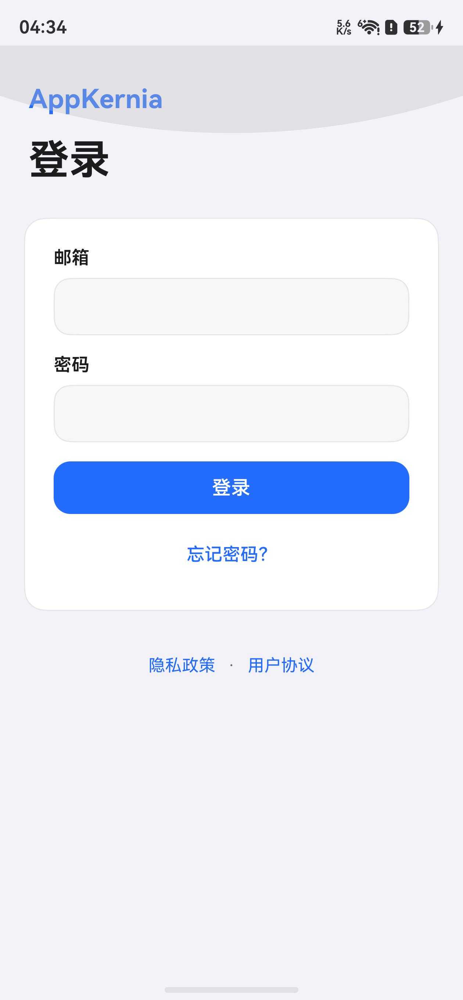

# AppKernia HarmonyOS 真机运行调试实录

> **历史证据边界（2026-08-26 补充）：** 本文保留的是使用 HBuilderX 生成身份 `io.dcloud.uniappx` 的旧调试链路，不满足当前“不得使用 HBuilder 默认基座/默认原生身份”的自定义基座目标，也不得作为 `com.appkernia.mobile` 的签名、安装或运行证据。当前 AppKernia 自定义 HAP、签名隔离和验收命令以 [`apps/ak-mobile/docs/custom-native-bases.md`](../../apps/ak-mobile/docs/custom-native-bases.md) 为准。本文以下内容仅用于追溯旧设备/工具链行为。

> 记录日期：2026-08-25（Asia/Shanghai）
>
> 仓库提交基线：`f527b0d`（运行时工作树包含未提交功能改动）
>
> 历史结论：旧 `io.dcloud.uniappx` 调试包曾在 USB 连接的 HarmonyOS 真机完成编译、调试签名、安装、启动和独立重启；该结果不能外推为当前 AppKernia 自定义原生身份通过。

## 1. 本次验收边界

本记录只陈述本次真实执行得到的证据：

- 真机通过 USB 被 `hdc` 识别；
- uni-app x 的 30 个页面完成 UTS/UVue 编译；
- HarmonyOS 原生工程依赖安装成功；
- debug HAP 构建、调试签名、真机安装和启动成功；
- 脱离 HBuilderX 的首次启动命令后，再次使用 `aa start` 启动成功；
- 真机实际渲染到 AppKernia 登录页，并保存一张设备原始分辨率截图。

本次没有把“编译成功”当作“真机运行成功”。真机运行证据包括 `bm install` 成功、`aa start` 成功、前台 Mission、App 进程 PID 和设备截图。

## 2. 环境

| 项目 | 实测值 |
| --- | --- |
| 主机 | macOS 26.4.1（25E253） |
| HBuilderX | 5.24.2026081301 |
| DevEco Studio | 6.0.2.640 |
| hdc | 3.2.0c |
| 设备 | HUAWEI Mate 60 Pro / ALN-AL00 |
| HarmonyOS | 6.1.0.135（SP8C00E120R10P11） |
| HarmonyOS API | 24 |
| 连接 | USB，`Connected` |
| 设备序列号 | `FMR0…1792`（文档脱敏） |
| 运行包名 | `io.dcloud.uniappx` |
| Ability | `entry / EntryAbility` |
| CPU ABI | `arm64-v8a` |

设备侧命令：

```bash
HDC=/Applications/DevEco-Studio.app/Contents/sdk/default/openharmony/toolchains/hdc
"$HDC" -v
"$HDC" list targets -v
"$HDC" shell param get const.product.model
"$HDC" shell param get const.product.software.version
"$HDC" shell param get const.ohos.apiversion
```

关键输出：

```text
Ver: 3.2.0c
FMR0…1792  USB  Connected  localhost
ALN-AL00
ALN-AL00 6.1.0.135(SP8C00E120R10P11)
24
```

## 3. 调试过程

### 3.1 HBuilderX 首次生成工程

执行：

```bash
env -u HTTP_PROXY -u HTTPS_PROXY -u ALL_PROXY \
  /Applications/HBuilderX.app/Contents/MacOS/cli launch app-harmony \
  --project /Users/payhon/project/AppKernia/apps/ak-mobile \
  --deviceId '<USB_DEVICE_SERIAL>' \
  --cleanCache true \
  --compile false \
  --continue-on-error false
```

结果：

- 30 个页面编译成功，包括 `pages/privacy/consent/index` 和 `pages/onboarding/index`；
- 生成工程位于 `apps/ak-mobile/unpackage/dist/dev/app-harmony`；
- HBuilderX 内置依赖安装第一次因 `@ohos/svg` registry 返回 `Invalid URL` 失败，进程未自行退出，人工中止；
- 此次不计作真机运行成功。

### 3.2 修复生成工程依赖

使用 DevEco Studio 随附的 `ohpm` 重新安装依赖：

```bash
cd apps/ak-mobile/unpackage/dist/dev/app-harmony
env -u HTTP_PROXY -u HTTPS_PROXY -u ALL_PROXY \
  /Applications/DevEco-Studio.app/Contents/tools/ohpm/bin/ohpm install --all
```

结果：退出码 `0`，`@ohos/svg` 安装成功。随后直接执行 Hvigor：

```bash
env DEVECO_SDK_HOME=/Applications/DevEco-Studio.app/Contents/sdk \
  /Applications/DevEco-Studio.app/Contents/tools/hvigor/bin/hvigorw \
  --mode module \
  -p product=default \
  -p module=entry@default \
  -p buildMode=debug \
  assembleHap --no-daemon
```

结果：`BUILD SUCCESSFUL in 26 s 504 ms`，生成未签名 HAP。此时仍不能据此声称真机运行成功。

### 3.3 DevEco Studio 直接部署失败记录

将生成工程载入 DevEco Studio 后点击 `Run 'entry'`，构建成功，但安装阶段真机明确拒绝未签名包：

```text
Launching io.dcloud.uniappx
hdc file send .../entry-default-unsigned.hap ...
hdc shell bm install ...
Install Failed: error: failed to install bundle.
code:9568320
error: no signature file.
Error while Deploy Hap
```

DevEco Studio 的 `Project Structure > Signing Configs` 会进入华为开发者登录流程；本次没有在仓库中手工写入证书密码，也没有提交任何签名文件。该路径作为失败排查证据保留，不计作成功运行。

排查中还发现 DevEco Studio 的 `Project Structure` 页面一度空白，并在 IDE 中出现 `IDE Internal Error Occurred`。因此最终采用 HBuilderX 官方真机运行链路自动完成调试签名。

### 3.4 HBuilderX 真机运行成功

补齐依赖后再次执行：

```bash
env -u HTTP_PROXY -u HTTPS_PROXY -u ALL_PROXY \
  /Applications/HBuilderX.app/Contents/MacOS/cli launch app-harmony \
  --project /Users/payhon/project/AppKernia/apps/ak-mobile \
  --deviceId '<USB_DEVICE_SERIAL>' \
  --cleanCache false \
  --compile false \
  --continue-on-error false
```

实测关键输出：

```text
项目 ak-mobile 编译成功。
安装鸿蒙工程依赖成功
运行包制作成功
安装 .hap 到鸿蒙设备 ...
安装成功
在鸿蒙设备上启动运行 .hap ...
运行成功
```

设备日志随后出现：

```text
AppSpawnChild ...
bundle name: io.dcloud.uniappx
ScheduleLaunchAbility called, ability EntryAbility
Lifecycle:name EntryAbility
SmartGC: app cold start finished
```

签名产物：

```text
apps/ak-mobile/unpackage/dist/dev/app-harmony/entry/build/default/outputs/default/entry-default-signed.hap
size: 18,219,417 bytes
sha256: 027d9b4746de5c0b1f64a82db6e421f296645f4d766c021127b928f9b0432df9
```

`unpackage/` 已被 `.gitignore` 排除。生成工程中的调试签名配置含本机凭据引用，不得复制到文档、日志或 Git。

### 3.5 独立停止并再次启动

停止 HBuilderX 日志流后，直接通过 `hdc` 重新启动应用：

```bash
HDC=/Applications/DevEco-Studio.app/Contents/sdk/default/openharmony/toolchains/hdc
"$HDC" shell aa force-stop io.dcloud.uniappx
"$HDC" shell aa start -a EntryAbility -b io.dcloud.uniappx
"$HDC" shell pidof io.dcloud.uniappx
"$HDC" shell aa dump -a
```

结果：

```text
force stop process successfully.
start ability successfully.
19294
Mission ID #43  mission name #[#io.dcloud.uniappx:entry:EntryAbility]
```

这证明应用已安装到真机，且不是只依赖一次性的 IDE 启动提示。

## 4. 真机截图

截图由设备端 `snapshot_display` 生成，原始尺寸为 `1260 × 2720`：



文件：`docs/manual/assets/appkernia-harmony-startup.jpeg`

SHA-256：`403f0e6241dfd4871a2b87747ba02b7c2ea7929dbcf00776ac9090fbb4ecdfd9`

截图显示 AppKernia 中文登录页已真实渲染，顶部状态栏和底部安全区均由真机提供。冷启动日志在设备发生触摸事件后出现本地 policy 状态写入并导航到登录页；由于保留截图发生在该交互之后，本截图**不能替代“首次隐私页首帧”证据**。

## 5. 验收矩阵

| 检查项 | 结果 | 证据/说明 |
| --- | --- | --- |
| USB 真机识别 | 通过 | `hdc list targets -v` 显示 USB Connected |
| UTS/UVue 编译 | 通过 | 30 个页面编译成功 |
| Harmony 依赖安装 | 通过 | `ohpm install --all` 退出码 0 |
| 未签名 HAP 构建 | 通过 | Hvigor `BUILD SUCCESSFUL` |
| 调试签名 HAP | 通过 | `entry-default-signed.hap` 已生成 |
| 真机安装 | 通过 | HBuilderX 输出“安装成功”且 `bm dump` 可读取包信息 |
| 真机启动 | 通过 | HBuilderX 输出“运行成功”，进程和 Mission 均存在 |
| 独立重启 | 通过 | `aa force-stop` 后 `aa start` 成功，新 PID 为 19294 |
| 真机 UI 渲染 | 通过 | 1260 × 2720 设备截图 |
| 首装隐私首帧 | 未单独留证 | 截图发生在用户交互及 policy 写入之后 |
| 同意前业务零网络 | 未验证 | debug websocket 属于调试通道，不能据此判断业务 API；需单独抓包/埋点验收 |
| 协议页往返、取消退出 | 未验证 | 本次未执行交互用例 |
| 启动介绍轮播 | 未验证 | 依赖已发布后台配置与版本状态 |

## 6. 已发现问题与建议

1. HBuilderX 警告“未正确配置鸿蒙应用的包名”，生成工程当前使用 `io.dcloud.uniappx`。这是调试包名，不应作为 AppKernia 发布包名；发布前必须配置正式 Bundle Name，并与后台 App ID、证书和 AppGallery Connect 应用保持一致。
2. DevEco Studio 直接打开生成工程时没有可用签名配置，点击运行会得到 `9568320 / no signature file`。日常真机调试优先使用 HBuilderX 运行链路；需要 DevEco Profiler/Inspector 时，应先准备正式的 `harmony-configs/build-profile.json5`，且不得提交密码或私钥。
3. HBuilderX CLI 即使传入 `--compile false`，本次仍重新编译了全部 30 个页面；不要把该参数理解为本次一定跳过编译。
4. 当前 `akRuntime.apiBaseUrl` 是 `http://127.0.0.1:8080/api/v1`。在真机上 `127.0.0.1` 指向手机自身，登录和公共配置请求若要访问 Mac 本地服务，需要改用可达的局域网地址或建立端口转发。
5. 若要补齐启动体验的完整真机验收，应在明确授权清除该调试包数据后执行“卸载/清数据 → 冷启动 → 隐私协议往返 → 同意 → 启动介绍 → 登录页”，并同时记录业务网络请求。清数据会删除设备上该包的本地状态，本次未擅自执行。

## 7. 可复用的最短运行步骤

```bash
# 1. 验证真机
HDC=/Applications/DevEco-Studio.app/Contents/sdk/default/openharmony/toolchains/hdc
"$HDC" list targets -v

# 2. 运行到指定真机（请替换设备序列号）
env -u HTTP_PROXY -u HTTPS_PROXY -u ALL_PROXY \
  /Applications/HBuilderX.app/Contents/MacOS/cli launch app-harmony \
  --project /Users/payhon/project/AppKernia/apps/ak-mobile \
  --deviceId '<USB_DEVICE_SERIAL>' \
  --cleanCache false \
  --compile false \
  --continue-on-error false

# 3. IDE 日志流停止后验证应用仍可启动
"$HDC" shell aa force-stop io.dcloud.uniappx
"$HDC" shell aa start -a EntryAbility -b io.dcloud.uniappx
"$HDC" shell pidof io.dcloud.uniappx
```

## 8. 参考资料

- [DCloud uni-app x HarmonyOS 开发指南](https://doc.dcloud.net.cn/uni-app-x/app-harmony/)
- [DCloud uni-app x manifest.json 配置](https://doc.dcloud.net.cn/uni-app-x/collocation/manifest.html)
- [Huawei HarmonyOS hdc 指南](https://developer.huawei.com/consumer/en/doc/harmonyos-guides/hdc)
