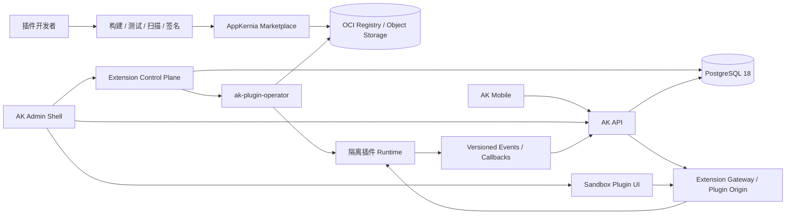
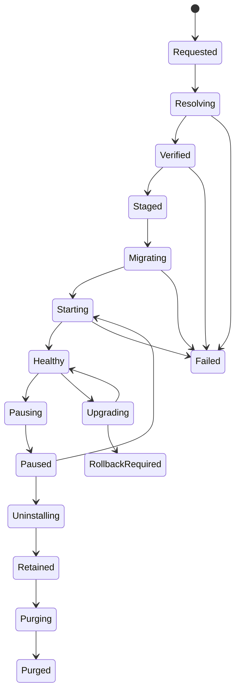

# AppKernia 可插拔插件架构与插件市场技术方案

> 状态：Proposed（方案评审稿，不代表已批准 ADR）
>
> 日期：2026-09-02
>
> 范围：Backend、Admin、Mobile、插件开发者生态、插件市场、IoT 与 AI 行业模块
>
> 目标版本：先建设私有/首方插件能力，再逐步开放第三方市场

## 1. 结论先行

技术上可行，但必须把“插件热插拔”限定为**受控能力的在线部署、路由切换、租户启停和卸载**，不能理解为把未知 Go、React、UTS 或原生代码直接加载进 AppKernia 核心进程。

推荐采用以下组合，而不是让所有端使用同一种插件机制：

| 边界 | 推荐方案 | 是否可在线热插拔 | 说明 |
|---|---|---:|---|
| 现有 8 个核心模块 | 显式注册、编译进 Go API/Worker | 仅可热启停已有能力 | 保持稳定，不市场化、不允许运行时替换 |
| 第一方行业插件 | 可先编译内置；需要独立扩缩容时转为服务插件 | 已部署版本可热启停 | 适合 IoT Core、AI Gateway 等首批验证模块 |
| 第三方 Backend 插件 | 签名 OCI 镜像、独立容器/Pod、通过版本化 API/Event 接入 | 是 | 不重启 `ak-api`，故障和权限与核心隔离 |
| 第三方 Admin UI | 独立 Origin 的 sandbox iframe + 版本化 Bridge | 是 | 不把第三方 JS 放进 Admin 同一 JavaScript 运行域 |
| Mobile 插件 | 随 App 编译的 Capability Pack + 服务端授权启停 | 仅已有能力可热启停 | 新 UVue/UTS/原生能力必须发新版 App |
| Go 标准库 `.so` 插件 | 不采用 | 否 | 无法可靠卸载，兼容与安全风险高 |
| WASM 扩展 | 暂缓 | 将来可行 | 仅在出现明确的纯规则/转换场景后评估独立 Runner |

推荐目标形态是：

```text
稳定核心 + 显式内置模块 + 进程外服务插件 + 沙箱 Admin UI + Mobile 随包能力
```

一期不建设公共市场、自动分账、自研容器调度器、通用 WASM 平台或插件间任意依赖；先用一个首方插件跑通签名、安装、授权、启停、升级、回滚和保留式卸载的完整垂直切片。

## 2. 目标、术语与非目标

### 2.1 目标

1. 开发者能按稳定 SDK 和 Manifest 开发、测试、打包、发布插件。
2. 管理员能查看权限与出网需求后安装、配置、授权、启停、升级、回滚和卸载插件。
3. 插件市场能支持免费、试用、合同许可、订阅及将来的用量计费。
4. 插件故障、越权或资源耗尽不能拖垮 AppKernia 核心服务。
5. 同一环境安装一次后，可按租户、App 和用户权限分别授权。
6. 为 IoT、AI 等行业能力提供清晰边界，不把行业复杂度继续堆进核心模块。

### 2.2 术语

| 术语 | 本方案定义 |
|---|---|
| 核心模块（Module） | 随 AppKernia 构建发布的可信代码，目前为 `iam/org/sys/storage/notify/jobs/audit/ops` |
| 插件包（Plugin Package） | 一组不可变、签名、可审核的 Manifest、服务制品、Admin UI、契约和双语资源 |
| 环境安装（Installation） | 将某个插件版本验证并部署到一个 AppKernia 环境 |
| 商业授权（Entitlement） | 某租户是否有权使用某插件、功能项和额度 |
| 租户启用（Activation） | 有授权的租户是否实际启用插件，可进一步绑定到 App |
| 热插拔 | 不重启 `ak-api` 或 Admin Shell 即可安装服务插件、切换流量、启停和卸载运行实例 |
| 清除（Purge） | 永久删除插件数据；与“卸载运行能力”严格分离 |

### 2.3 非目标

- 不允许市场包向生产代码仓写入或删除 Go/React/UTS 源码。
- 不允许插件修改核心 import、启动函数或任意 GoFrame 路由。
- 不允许插件直接执行宿主 Shell、上传任意二进制到核心进程或调用 Docker Socket。
- 不允许插件直连核心 PostgreSQL Schema、读取其他插件数据或接收 Admin 原始 Token/Cookie。
- 不承诺 Mobile 新页面、UTS、原生 SDK 的在线下载安装。
- 不承诺任意数据库迁移都能一键回滚。
- 不在一期支持插件依赖其他插件；插件只依赖版本化平台能力，出现真实需求后再引入依赖图。

## 3. AppKernia 现状与改造前提

### 3.1 当前技术事实

- Backend 固定为 GoFrame + pgx/v5 + sqlc + PostgreSQL 18，设计目标是模块化单体。
- [`blueprint/backend/AK_BACKEND_BLUEPRINT.md`](../../blueprint/backend/AK_BACKEND_BLUEPRINT.md) 已经定义显式 `Module` 接口和 Composition Root，禁止依赖 `init()` 隐式注册；但当前 [`server/internal/bootstrap/api.go`](../../server/internal/bootstrap/api.go) 仍集中构造依赖和注册路由，[`server/cmd/ak-worker/main.go`](../../server/cmd/ak-worker/main.go) 仍集中注册 Worker。插件化前应先完成这项**不改变业务行为**的模块注册重构。
- [`blueprint/backend/spec/core-modules.json`](../../blueprint/backend/spec/core-modules.json) 固定 8 个核心模块；`sys.modules` 是编译期目录，Seed 会清理目录外记录。它不能改造成市场插件安装表。
- Admin 是 React/Vite 静态 SPA，[`apps/ak-admin/src/app/route-registry.ts`](../../apps/ak-admin/src/app/route-registry.ts) 只接受静态登记的 `component_key`，未知组件会被拒绝。
- Mobile 使用 uni-app x + UTS/UVue，页面同时静态登记于 [`apps/ak-mobile/pages.json`](../../apps/ak-mobile/pages.json) 和 [`apps/ak-mobile/src/core/navigation/app-routes.uts`](../../apps/ak-mobile/src/core/navigation/app-routes.uts)。当前 [`mobileprofile` 服务](../../server/internal/modules/mobileprofile/application/service.go) 也明确拒绝向 `uni_app_x` 发布 WGT。
- 当前 [`AGENTS.md`](../../AGENTS.md) 安全规则禁止生产 Shell、任意源码写入、在线二进制插件和动态执行代码。

### 3.2 必须先处理的授权缺口

当前 [`tenantadmin` Repository](../../server/internal/modules/tenantadmin/repository/postgres.go) 在创建租户时，会把所有 `active` 权限和全局菜单授予租户超级管理员；[`iam.sql`](../../server/db/queries/iam.sql) 和 [`menu.sql`](../../server/db/queries/menu.sql) 的有效权限/菜单查询也只计算 RBAC。若直接新增付费插件权限，新租户可能自动获得尚未购买的能力。

插件一期必须把最终授权改为以下交集，并在后端 SQL 层强制执行：

```text
插件版本未撤回
∩ 环境安装 healthy
∩ 租户 entitlement 为 trial/active/grace
∩ 租户 activation enabled
∩ App binding 匹配（如需要）
∩ 用户 RBAC permission 命中
```

菜单和前端按钮仍只是展示层，不能替代此后端判定。

### 3.3 治理前提

本方案改变了现有“只允许编译期模块”的边界。开始实现前必须新增 ADR 和威胁模型，并同步 Backend/Admin/Mobile 蓝图、OpenAPI、数据库规格、权限矩阵和安全规则。ADR 应明确：

1. 仍然禁止未知代码进入核心进程和 Admin 同域。
2. 仅允许经过签名和策略校验的进程外服务插件。
3. Admin 第三方 UI 仅通过隔离 iframe 运行。
4. Mobile 仍坚持随包编译，不开放远程代码执行。
5. “卸载”默认保留数据，“永久清除”是独立破坏性动作。

## 4. GoFly 插件机制研究与借鉴结论

### 4.1 公开可验证的实现方式

截至 2026-09-02，根据 [GoFly 官网](https://goflys.cn/)、[GoFlyGen 页面](https://goflys.cn/goflygen)、[代码市场](https://goflys.cn/codemarket) 和 [GoFlyAdmin 固定提交 README](https://github.com/huanglishi/GoFlyAdmin/blob/fd142c57311579efb62b0af84e9e89f5b37a725c/README.md)，GoFly 的公开插件能力更准确地说是：

```text
代码市场分发源码包
→ 安装器把 Go/Vue/菜单/SQL 写入项目
→ 修改注册入口或通过目录/反射注册
→ 开发期由 fresh 等工具重新编译
→ 生产重新构建并部署二进制/前端
```

可观察证据包括：

- 官网和 README 使用“代码仓插件”“代码打包上传”“向项目安装代码”的表述。
- 插件模板包含 [`config.yml`](https://github.com/huanglishi/GoFlyAdmin/blob/fd142c57311579efb62b0af84e9e89f5b37a725c/resource/developer/codetpl/packcode/config.yml)、SQL 与菜单数据。
- 安装代码会写入项目目录并更新注册入口，见 [`generatecode.go`](https://github.com/huanglishi/GoFlyAdmin/blob/fd142c57311579efb62b0af84e9e89f5b37a725c/app/business/developer/generatecode.go) 和 [`generatecommon.go`](https://github.com/huanglishi/GoFlyAdmin/blob/fd142c57311579efb62b0af84e9e89f5b37a725c/app/business/developer/generatecommon.go)。
- README 将 `fresh` 描述为开发期热编译；生产仍执行 `go build` 和前端构建。
- [公开市场中的 MQTT 插件说明](https://api.goflys.cn/site/codemarket/getContent?id=112)仍要求修改统一启动/关闭位置，并提示安装期间切换编译方式。这进一步说明其“安装即用”不等于独立进程的生产运行时卸载。

因此，GoFly 的优势是**源码包管理与代码商品市场体验**，不是可隔离、可撤销的生产运行时插件沙箱。其企业版完整安装器并未全部开源，公开资料不足以确认签名、SBOM、依赖解析、事务回滚、租户授权和供应链撤回机制；本方案不对这些未知能力作推断。

### 4.2 可借鉴与不可照搬

| 方面 | 可借鉴 | AppKernia 不照搬的部分 |
|---|---|---|
| 产品体验 | 分类、搜索、详情、免费/付费、版本、安装/卸载入口 | 不把按钮成功等同于运行与数据迁移全部成功 |
| 开发者生态 | 开发者认证、发布、定价、维护、评分 | 身份认证不能替代制品安全审核 |
| 插件包 | 前后端、菜单、配置、数据说明成套交付 | 不向生产仓库复制源码，不现场修改 import |
| 生命周期 | 一键安装、卸载的低认知成本 | 内部必须有可恢复状态机、审计和失败处置 |
| 商业模式 | 永久授权、套餐、更新服务期可作为 SKU | AI/IoT 云能力还需订阅和用量计费 |
| 数据 | 插件声明自身表和初始数据 | 不执行任意 SQL，不自动 `DROP TABLE`，不修改核心 Schema |
| 路由与代码 | 统一目录和注册约定 | 不使用 `init()` + 反射隐式注册，不把第三方代码编入核心进程 |

### 4.3 对 AppKernia 的直接启示

1. 借鉴 GoFly 的**插件包约定、发布流程和一键体验**。
2. 将“一键”实现为有审计、可恢复的异步操作，而不是生产源码覆盖。
3. 市场卖的是不可变版本和能力授权，运行制品通过 OCI digest 精确锁定。
4. 若未来确有“购买源码模板”需求，可作为独立的开发期商品，由 CLI 在本地受版本控制的工作区安装；它不属于生产热插拔，也不进入一期。

## 5. 目标架构



### 5.1 核心组件

| 组件 | 职责 | 部署建议 |
|---|---|---|
| `extension` 模块 | Manifest、安装状态、租户启用、配置、权限、菜单投影、兼容性判定 | 先留在现有 Go 模块化单体 |
| `marketplace` 模块 | 发布者、商品、版本、审核、价格、订单、订阅、许可证、撤回 | 一期先做私有目录；出现独立规模后再拆服务 |
| Extension Gateway | 固定通配路由、认证、租户/App 作用域、授权、限流、审计、反向代理 | `ak-api` 内部平台组件 |
| `ak-plugin-operator` | 拉取、验签、部署、健康检查、切流、停机、清理运行制品 | 必须与 API 分进程并隔离特权 |
| Plugin Runtime | 执行第三方/独立服务插件 | 独立容器或 Pod |
| Plugin UI Host | 解析菜单和 iframe 页面、建立安全 Bridge | Admin 内静态编译的唯一通用宿主页 |
| Mobile Capability Registry | 判断某能力是否已随包编译且当前可用 | Mobile 内静态注册 |

### 5.2 为什么不用 Go `.so` 插件

[Go `plugin` 官方文档](https://pkg.go.dev/plugin)明确说明其平台支持有限、无法关闭插件，且宿主与插件必须使用完全一致的工具链、构建标签和依赖版本；竞态检测也更困难。它不适合 AppKernia 的跨平台构建、静态镜像、滚动升级和第三方安全隔离。

### 5.3 热插拔能力边界

本方案可以承诺：

- 服务插件安装、启用、禁用、升级、切流和卸载不重启 `ak-api`。
- Admin 插件页面可在刷新菜单后出现或消失，不重构 Admin Shell。
- 同一安装可按租户和 App 即时授权或撤销。
- 插件崩溃时核心仍可工作，网关返回稳定错误码并熔断。

本方案不能承诺：

- Mobile 新代码不经应用商店/企业分发即可出现。
- 插件数据库发生破坏性迁移后仍能自动无损降级。
- 安装任何未知制品都安全；安全来自审核、签名、隔离和最小权限的共同约束。

## 6. 插件类型与信任等级

### 6.1 制品类型

一个插件版本可以包含多种 Artifact，但各端执行规则不同：

| Artifact | 交付形态 | 运行位置 | 信任要求 |
|---|---|---|---|
| `server` | OCI image，按 digest 锁定 | 独立容器/Pod | 可为审核后的第三方 |
| `admin` | 静态资源，市场重新托管到独立 Origin | sandbox iframe | 可为审核后的第三方 |
| `mobileCapability` | 能力 ID、最低 App 版本、平台范围；代码已随 App 编译 | App 内 | 只允许第一方/随包审核代码 |
| `builtin` | Go/React/UTS 源码随 AK 构建 | 核心进程/应用 | 与核心相同信任等级 |

首版不允许 Marketplace Manifest 声明 shell hook、任意 SQL、动态 import、宿主路径写入或可执行表达式。

### 6.2 信任等级

| 等级 | 示例 | 可用能力 |
|---|---|---|
| `core` | 8 个稳定核心模块 | 完整内部 Port，但仍遵守模块边界 |
| `first_party` | 官方 IoT/AI 插件 | 可发布内置或服务型制品 |
| `verified` | 企业认证且审核通过的第三方 | 仅进程外服务、iframe、声明式贡献点 |
| `community` | 未经人工审核的投稿 | 只进入市场审核队列，不能安装到生产 |

## 7. 插件包与 Manifest

### 7.1 制品规范

- Server 使用 OCI Image/Artifact；必须以 digest 安装而不是可变 tag。
- Admin 静态资源同样生成内容摘要，由市场托管；不从发布者任意 URL 直接执行。
- 版本不可覆盖；修复必须发布新 SemVer。
- 每个版本附带签名、CycloneDX SBOM、构建来源证明、许可证、扫描结果和两套语言资源。
- OCI 提供制品与元数据承载能力，签名应绑定具体 digest，参考 [OCI Image Manifest](https://specs.opencontainers.org/image-spec/manifest/)、[Cosign 验证](https://docs.sigstore.dev/cosign/verifying/verify/) 和 [CycloneDX SBOM](https://cyclonedx.org/guides/sbom/)。

### 7.2 Manifest 草案

以下仅用于固定方案边界；字段在 P0 通过 JSON Schema 和 ADR 定稿：

```yaml
apiVersion: plugins.appkernia.io/v1alpha1
kind: Plugin
metadata:
  id: com.example.asset-management
  version: 1.2.0
  publisher: com.example
  name:
    zh-CN: 资产管理
    en-US: Asset Management
spec:
  compatibility:
    coreApi: ">=1.4.0 <2.0.0"
    pluginProtocol: "1.x"
    adminBridge: "1.x"
  artifacts:
    server:
      image: registry.example.com/com.example/asset-management@sha256:...
      platforms: [linux/amd64, linux/arm64]
    admin:
      digest: sha256:...
      entry: /index.html
    mobileCapability:
      id: asset-management.v1
      minAppVersion: 2.3.0
      platforms: [android, ios, harmony]
  contributions:
    permissions:
      - plugin.com.example.asset-management.asset.read
    menus:
      - code: plugin.com.example.asset-management.assets
        permission: plugin.com.example.asset-management.asset.read
        view: assets
        titleKey: plugin.asset.menu.assets
    routes:
      - operationId: listAssets
        method: GET
        path: /assets
        permission: plugin.com.example.asset-management.asset.read
    events:
      consumes: [appkernia.app.deleted.v1]
      produces: [com.example.asset.asset.created.v1]
  config:
    schema: config.schema.json
    secretFields: [upstreamToken]
  data:
    retention: retain_on_uninstall
    exportSupported: true
  network:
    egressAllowlist: [api.example.com:443]
  resources:
    cpu: "500m"
    memory: "512Mi"
  licensing:
    metering: none
```

### 7.3 命名与兼容规则

- 插件 ID 使用反向域名，发布后不可变。
- 权限、菜单、配置键、事件和指标全部使用插件命名空间。
- Manifest Schema、Core API、Plugin Protocol、Admin Bridge 分别版本化，不能只比较 AppKernia 产品版本。
- `zh-CN` 与 `en-US` key 和占位符必须完全一致，默认和最终回退仍为 `zh-CN`。
- 所有不认识的必需字段、权限、Capability 或协议版本必须 fail closed。
- 一期只允许依赖平台 Capability，例如 `storage.object.v1`；不允许插件间依赖，避免循环、级联卸载和版本求解器。

## 8. Backend 设计

### 8.1 内置模块先显式化

先按现有蓝图实现 `Module` 显式注册，把 API 路由、Worker、权限、菜单和 Seed 从集中 Bootstrap 拆到现有领域模块。该步骤只改善 Composition Root，不引入运行时加载器，也不改变 `sys.modules` 的 8 个稳定条目。

该重构的价值是形成清楚的核心边界和可复用 Platform Port；它不是第三方热插拔本身。

### 8.2 固定网关，不动态注册 GoFrame 路由

核心只注册两组稳定通配入口：

```text
/admin-api/v1/extensions/{plugin_id}/{path...}
/api/v1/extensions/{plugin_id}/{path...}
```

网关处理顺序：

```text
认证
→ 解析 tenant/app/user
→ 校验 installation + entitlement + activation
→ 由 Manifest 将 method/path 映射到 permission
→ RBAC 与限流
→ 写审计上下文
→ 签发短期插件令牌
→ 代理到健康实例
```

插件启停只原子切换“插件 ID → 健康 Endpoint”的内存快照或缓存版本，不修改 GoFrame 路由，不在宿主加载或卸载代码。

网关第一版支持 HTTP/JSON 和 SSE；WebSocket 在 IoT 试点确有需求时增加，并沿用同样的安装、授权和审计判定。

### 8.3 插件身份与请求上下文

- 核心到插件使用 mTLS，服务证书绑定 installation/runtime identity。
- 每次请求签发极短期 JWT，`aud=ak-plugin:<plugin_id>`，只包含必要的 tenant、app、user、operation、permission 和 request ID。
- 不转发 Admin Cookie、原 Access Token、Refresh Token 或完整权限集合。
- 插件必须再次校验 audience、issuer、期限、operation 和租户作用域。
- 插件调用 Platform API 使用独立工作负载身份和声明过的 Scope，不能继承用户全部权限。

### 8.4 平台扩展点

首版只提供有限且稳定的扩展点：

1. 版本化 HTTP API。
2. Transactional Outbox 发出的版本化领域事件。
3. 由核心触发的异步任务回调。
4. 对象存储预签名上传/下载能力。
5. Secret 引用解析，秘密值不通过市场保存。
6. 声明式权限、菜单、配置和健康状态。

不提供任意 Middleware、SQL Hook、Go Callback、Shell、反射注册或核心事务内插件回调。跨插件事务使用最终一致性；插件通过 Inbox 键保证事件幂等。

契约归属保持清晰：核心 OpenAPI 只描述插件管理接口和 Gateway 通用边界；每个插件包携带自己的 OpenAPI 3.1。Admin iframe 在发布时生成自己的 Client，Mobile 只使用随 App 编译的 Client。安装过程不合并源码、不改写核心 OpenAPI，也不在生产环境运行代码生成器。Gateway 对连接失败、超时、插件暂停和不兼容返回稳定的核心错误码，插件业务错误码使用插件命名空间。

### 8.5 Operator

市场 API 只写 desired state；`ak-plugin-operator` 负责 reconcile，避免 `ak-api` 持有容器编排特权。

- 单机/私有部署：优先使用专属于插件的 rootless 容器运行环境；若只能使用 Docker Socket，应由隔离的 Operator/授权代理独占，绝不挂到 API 或通用 Worker。
- Kubernetes：未来使用 namespace-scoped ServiceAccount 管理 Deployment/Service/Secret/NetworkPolicy；一期不自建 CRD 也不要求服务网格。
- 插件容器默认 non-root、只读根文件系统、drop capabilities、禁止宿主挂载、限制 CPU/内存/PID/临时存储，并默认拒绝出网。

### 8.6 管理 API 草案

一期最小接口面：

```text
GET    /admin-api/v1/plugin-catalog
GET    /admin-api/v1/plugin-catalog/{plugin_id}/versions/{version}
POST   /admin-api/v1/plugin-installations
GET    /admin-api/v1/plugin-installations/{id}
POST   /admin-api/v1/plugin-installations/{id}/upgrade
POST   /admin-api/v1/plugin-installations/{id}/pause
POST   /admin-api/v1/plugin-installations/{id}/resume
DELETE /admin-api/v1/plugin-installations/{id}
POST   /admin-api/v1/plugin-installations/{id}/purge
PUT    /admin-api/v1/plugin-activations/{plugin_id}
```

安装、升级、卸载和清除是异步 Operation，返回 `202 + operation_id`。所有写请求使用 `Idempotency-Key`，客户端通过查询或 SSE 获取状态；不在 HTTP 请求中等待镜像拉取或迁移完成。

## 9. 数据模型与隔离

### 9.1 不复用 `sys.modules`

`sys.modules` 继续只描述当前构建包含的 8 个核心模块。新增独立 Schema（名称建议 `extension`），避免把核心构建目录、市场商品和租户授权混成一张表。

### 9.2 最小数据模型

| 表/聚合 | 作用 |
|---|---|
| `extension.packages` | 插件稳定 ID、发布者和本地目录缓存 |
| `extension.package_versions` | 版本、Manifest、digest、签名/审核/撤回状态 |
| `extension.installations` | 环境级期望/实际版本、状态、Endpoint、健康状态 |
| `extension.operations` | 安装/升级/卸载 Saga、幂等键、错误、恢复点 |
| `extension.tenant_entitlements` | 许可、功能项、额度、有效期、宽限期 |
| `extension.tenant_activations` | 租户启停、配置版本、App 绑定 |
| `extension.secret_refs` | 只保存 Secret Provider 引用，不保存明文 |
| `extension.meter_events` | 将来用量计费的幂等原始计量事件 |

发布者、商品、审核、定价、订单等 Marketplace 数据可先与上述 Schema 同库分域；只有独立运营、扩展规模或隔离要求出现时再拆服务/数据库。

### 9.3 插件业务数据

优先级如下：

1. 外部服务插件使用独立数据库。
2. 必须共用 PostgreSQL 时，使用独立 `ext_<publisher>_<plugin>` Schema、独立登录角色和 Schema Owner。
3. 插件角色只能访问自己的 Schema，不得访问 `iam/sys/audit` 或其他插件表。
4. 核心数据只通过版本化 Platform API 和事件获得。
5. 插件迁移只作用于自己的 Schema，由专属 migrator 身份执行，不使用 `ak_app` 做 DDL。

## 10. 生命周期、升级与卸载

### 10.1 三套状态必须分离

发布版本状态：

```text
draft → submitted → scanning → review_pending → approved → published
                                  ↘ rejected
published → deprecated | revoked
```

环境安装状态：



商业授权和租户启用状态：

```text
entitlement: trial | active | grace | suspended | expired | revoked
activation:  enabled | disabled
```

一个 `status` 字段不能同时表达这三套事实。

### 10.2 操作可靠性

- 每个 Operation 带幂等键、请求 ID、操作者、租户、前后状态、制品 digest 和稳定错误码。
- 同一 Installation 的变更串行化；不同插件可并行。
- 每个步骤先记录状态再执行可重试动作，Operator 重启后可继续 reconcile。
- 安装失败时撤销新路由和临时运行实例，但不删除已存在的旧版本或业务数据。
- Marketplace 撤回版本后禁止新装/升级；是否强制停用由安全等级和管理员策略决定，并完整审计。

### 10.3 升级与回滚

推荐流程：

```text
兼容性预检
→ 权限/出网差异审批
→ 备份或恢复点
→ expand migration
→ 启动新版本并健康检查
→ 原子切流
→ drain 旧版本
→ 稳定观察
→ contract migration
```

代码回滚仅在新旧版本都兼容当前数据 Schema 时自动执行。破坏性数据变更不允许与切流放在同一步；无法自动回滚时进入 `rollback_required`，保留旧制品和恢复证据。

### 10.4 Pause、Deactivate、Uninstall 与 Purge

- **Pause**：环境级紧急停用，拒绝全部租户的新请求/任务/事件，撤销临时凭据，drain 在途请求并按策略停机。
- **Deactivate**：仅撤销指定租户/App 的菜单、路由和授权，不影响其他租户或环境运行实例。
- **Uninstall**：移除运行实例和制品缓存，撤销菜单、路由、授权和 Secret 访问，业务数据进入 `retained`。
- **Purge**：在展示影响范围、依赖、保留期、法律冻结和备份结果后，由独立权限执行永久删除。

卸载绝不隐式 `DROP TABLE`；许可证过期也不能删除客户数据，应保留导出与续费路径。

## 11. Admin UI 插件方案

### 11.1 两档 UI

1. **第一方内置 UI**：继续静态 import 和 Route Registry，体验最好；新增代码需要 Admin 重建，已编译能力可按安装/授权即时显隐。
2. **第三方运行时 UI**：Admin 只静态注册一个通用插件宿主页，页面内容来自独立 Origin 的 sandbox iframe。

不对第三方采用 Module Federation、remote ESM 或远程 Web Component。它们会让第三方脚本进入 Admin 同一 JavaScript Realm，可读取 DOM、内存 Token 和宿主全局；Shadow DOM 也不是安全边界，卸载后副作用无法可靠清理。

### 11.2 页面与菜单

- 插件只声明 `view` 和菜单元数据，不能声明 JavaScript URL 或 import path。
- 后端将有效菜单投影为固定宿主路由，例如 `/extensions/$pluginId/$viewKey`。
- 宿主页根据 Installation/Manifest 解析经过市场托管的独立 Origin。
- 直接访问 URL 与菜单进入必须执行同一后端授权；未知、撤回、不健康或未授权插件 fail closed。

### 11.3 iframe 安全边界

- 每个插件使用独立无核心 Cookie 的 Origin；不允许与 Admin 同源。
- Host 设置精确 `frame-src`、sandbox 和 Permissions Policy；禁止顶层导航和逃逸式弹窗。
- 插件设置精确 `frame-ancestors`；不允许被未授权站点嵌入。
- `postMessage` 同时校验 `origin`、`source`、Bridge 版本、消息 Schema 和一次性 load nonce。
- Bridge 只提供主题、Locale、路由、尺寸、通知和少量已枚举能力，不能成为任意 RPC。
- 插件不能接收 Admin Access/Refresh Token。Host 生成一次性 launch ticket，插件后端兑换为短期、插件 audience 的 HttpOnly 会话。
- 卸载时销毁 iframe、撤销 ticket/session、菜单、路由和授权。

### 11.4 国际化与体验

- Manifest 菜单必须提供 `zh-CN`/`en-US`，两套 key/占位符一致。
- Host 通过 Bridge 通知 Locale、Theme 和时区变化；插件自行加载对应语言包。
- 第三方页面仍需满足键盘操作、焦点管理、响应式、错误/空/加载状态和 WCAG 基线。
- 插件崩溃或超时只影响当前 iframe；Host 提供统一错误边界、重载与诊断 ID。

## 12. Mobile 插件方案

### 12.1 能力边界

uni-app x 页面和 UTS/原生能力必须随 App 编译。DCloud 的 [`pages.json` 文档](https://doc.dcloud.net.cn/uni-app-x/collocation/pagesjson.html)也说明页面需要在构建配置中注册；当前 AK Mobile 契约进一步禁止服务端下发页面代码、脚本或动态路由。

此外，[Apple App Review Guidelines 2.5.2](https://developer.apple.com/app-store/review/guidelines/)限制下载、安装或执行改变应用功能的代码；[Google Play Device and Network Abuse](https://support.google.com/googleplay/android-developer/answer/16559646?hl=en)也限制从 Play 之外下载 dex、JAR、`.so` 等可执行代码。因此 Mobile 不应宣传“任意插件在线安装”。

### 12.2 Mobile Capability Registry

新增静态 `MobileCapabilityRegistry`，运行时可用能力取以下交集：

```text
随包编译能力
∩ 当前平台和 build variant
∩ Manifest/Schema hash 匹配
∩ 服务端插件已安装
∩ 租户 entitlement 与 activation 有效
∩ 用户 permission 命中
∩ Feature Flag 开启
∩ 最低 App 版本满足
```

市场/API 必须准确返回：

- `active`
- `disabled`
- `upgrade_required`
- `unsupported_platform`
- `incompatible`

未知 Capability、版本或 Schema 不匹配一律 fail closed；深链不能绕过静态 Route Registry。

### 12.3 可下发与不可下发内容

服务端可下发：配置数据、授权、Feature Flag、预定义 operation、模型/知识库选择、内容和受控展示参数。

服务端不可下发：JS、UTS、UVue、原生库、页面路径、任意 URL、动态权限申请逻辑或新的系统能力。BLE、NFC、定位、后台运行、厂商 SDK 和新隐私权限必须通过 `uni_modules/ak-*` 随新 App 版本发布并完成 Android/iOS/HarmonyOS 验收。

一期插件购买和市场管理只放在 Admin/Web；Mobile 只展示组织已购买并已启用的业务能力，避免形成通用“App 内插件商店”及额外支付/审核风险。

## 13. 安全与供应链

### 13.1 发布审核

自动门禁至少包括：

- Manifest JSON Schema 和兼容范围。
- digest、发布者签名和市场复签。
- SBOM、来源证明、许可证、已知漏洞和秘密扫描。
- OpenAPI 路由、权限、菜单和事件命名冲突。
- 新增权限、数据分类、出网域名和资源上限差异。
- `zh-CN`/`en-US` key 与占位符一致性。
- 镜像用户、Capabilities、入口、健康检查和支持架构。

高权限、PII、跨境出网、IoT 控制、AI 数据处理和新增系统权限必须人工复核。插件升级若扩大权限、数据访问或出网范围，管理员必须重新批准，不能静默继承旧授权。

### 13.2 运行隔离

- non-root、只读根文件系统、禁止特权模式和宿主挂载。
- 默认拒绝出网，按 Manifest 与部署策略取交集后放行。
- CPU、内存、PID、临时存储、请求大小、并发和超时限制。
- 插件独立服务身份、Secret、网络和数据库角色。
- 插件崩溃、超时和错误率触发熔断，不级联拖垮核心。
- 不允许插件注册核心 River Worker 或在核心事务内执行第三方代码。

### 13.3 多租户与 Confused Deputy 防护

- tenant/app/user 作用域只能由核心从认证上下文生成，不接受客户端或插件自行声明。
- Gateway 按 Manifest operation 映射权限，不能让插件用任意 path 绕过授权。
- 插件令牌只对一个插件 audience、一个短时间窗和一组 operation 有效。
- Platform API 再次校验调用插件身份、tenant 和 capability grant。
- 插件数据查询必须在 SQL/服务端层强制租户过滤。

### 13.4 审计与应急

发布、审核、签名、安装、配置、授权、启停、升级、回滚、撤回、卸载和 Purge 全部记录：

```text
actor / actor_type / tenant_id / plugin_id / version / digest
operation_id / request_id / before / after / result / stable_error_code
```

平台需要支持：版本撤回、签名密钥撤销、紧急禁用、禁止新安装、租户通知和受影响安装查询。日志不得记录 Secret、Token、提示词敏感正文或设备凭据。

## 14. 插件市场与商业模式

### 14.1 市场边界

市场分为两部分：

- **中央市场**：发布者、商品、版本、审核、制品索引、定价、订单、订阅、公告和撤回。
- **本地控制面**：安装、兼容性、运行状态、租户授权、配置、Secret 引用、审计和离线许可证缓存。

中央市场不能直接进入租户数据库或执行插件；本地环境只信任签名、digest 和明确许可证，不信任市场返回的可变 URL 或脚本。

### 14.2 发布流程

```text
开发者认证
→ 创建插件 ID
→ CLI 校验与测试
→ 构建不可变制品
→ 生成 SBOM/来源证明
→ 发布者签名
→ 自动扫描
→ 人工审核（按风险）
→ 市场复签
→ 发布
→ 安装反馈、评分与维护
```

### 14.3 商业模型

支持模型：

| 模型 | 适用场景 |
|---|---|
| 免费 | 示例插件、生态获客、基础连接器 |
| 试用 | 首方商业插件、企业评估 |
| 一次性许可 + 维护期 | 私有部署、相对静态行业功能 |
| 月/年订阅 | 持续升级、云连接器、IoT 管理 |
| 功能项/配额 | 分层套餐和企业合同 |
| 用量计费 | AI Token、Embedding、文档处理等可审计用量 |

一期只实现“免费、试用、人工合同许可、首方付费插件”。自动分账、税务、开发者结算、退款编排和复杂用量账单在出现真实交易后再建设。

### 14.4 许可证与失效策略

离线许可证至少绑定：

```text
installation_id / tenant_id / plugin_id / features / quota
nbf / exp / grace / issuer / key_id
```

本地只保存验证公钥和最后一次有效结果。进入 `grace` 时告警但保持业务连续；宽限期结束后禁止新的付费操作并保留只读/导出能力。许可证过期或撤回不得自动删除数据。

## 15. 开发者体验与 SDK

插件 Runtime 协议采用 HTTP/OpenAPI，语言无关；第一版只提供 Go Server SDK、OpenAPI 契约和 Admin Bridge SDK，其他语言可直接按契约实现，不为尚不存在的生态提前维护多语言 SDK。

建议 CLI：

```text
ak plugin init
ak plugin validate
ak plugin dev
ak plugin test
ak plugin pack
ak plugin sign
ak plugin publish
```

最小开发闭环：

1. `init` 生成 Manifest、Server 健康端点、Admin iframe 和双语资源最小模板。
2. `validate` 检查 Schema、命名、权限、兼容范围、i18n、OpenAPI 和禁止项。
3. `dev` 启动本地插件和模拟 Platform API，不修改 AppKernia 源码。
4. `test` 运行契约、租户隔离、权限和生命周期自检。
5. `pack/sign/publish` 生成并发布不可变制品。

开发者文档必须覆盖：最小权限、租户隔离、幂等、数据导出/保留、升级迁移、稳定错误码、双语、可访问性和安全事件响应。

## 16. IoT 行业插件规划

不要一开始拆出十几个微插件。先做一个边界完整的 `ak.iot-core` 验证插件内核，再按独立扩缩容或协议边界拆分。

### 16.1 第一阶段

#### `ak.iot-core`

- 产品、物模型、设备、证书/身份、分组标签。
- 设备影子/数字孪生的期望与上报状态。
- 命令、幂等键、投递回执、超时和审计。
- 设备事件、告警与基础规则。
- 依赖现有 `iam/org/jobs/notify/storage/audit/ops` 平台能力。

#### MQTT/协议接入

- Broker 作为外部基础设施，首版不自研 Broker。
- MQTT 认证、ACL、上下线和消息归一化通过独立服务插件/Adapter 接入。
- 协议映射使用受控、可校验规则，不允许运行任意脚本或 Shell。
- 高频遥测不直接挤入核心业务表；初期用 PostgreSQL 分区表，只有真实容量和查询指标证明不足后才引入 TimescaleDB/ClickHouse。

### 16.2 后续能力

- `ak.iot-ota`：固件、灰度、签名、批次、进度、失败恢复和硬件安全确认。
- 规则告警：限制执行时长、频率与扇出；动作必须白名单化。
- Mobile：BLE/NFC/定位/后台通信全部作为随包 `ak-iot-*` Capability，服务端只能激活已经编译的能力。

## 17. AI 行业插件规划

### 17.1 `ak.ai-gateway`

- Provider/Model 目录，Provider Adapter 编译期注册。
- Chat、Embedding、Rerank 和流式响应。
- 路由、降级、超时、重试、限流、预算和配额。
- Secret 引用、出网策略、用量成本、审计和内容安全。
- 不把 Provider API Key 暴露给 Admin、Mobile 或其他插件。

`ak.ai-gateway` 适合作为第一个服务插件试点：它能验证 SSE、Secret、出网白名单、用量计量和独立扩缩容，同时不要求 Mobile 新原生能力。

### 17.2 `ak.ai-knowledge`

- 知识库、数据源、文档、解析、分块、Embedding、索引、检索和引用。
- 摄取任务通过异步协议执行，文件使用现有 Storage 能力。
- 强制租户、知识库和文档 ACL 隔离；检索不能只按向量相似度而忽略权限。
- MVP 在部署环境确认扩展可用后采用 PostgreSQL + pgvector；只有确有第二种向量存储需求时再抽象通用 Adapter。
- 文档解析器在隔离 Worker 中运行，限制文件类型、大小、CPU、内存和网络，防止恶意文档。

### 17.3 后续 `ak.ai-assistant`

- RAG 会话、助手配置、评测和受控工作流。
- 工具调用只能引用已注册、显式授权的 Platform Capability。
- 不开放任意 Python/JavaScript/Shell 或在线生成后直接执行代码。
- 重点覆盖提示注入、PII、数据驻留、模型出网和成本失控。

## 18. 分阶段实施路线

### P0：决策与契约

交付：

- ADR：插件信任/运行模型、热插拔定义、Admin iframe、Mobile 边界、卸载数据策略。
- 威胁模型和发布/安装/授权三套状态机。
- Manifest JSON Schema、兼容策略、命名规则和稳定错误码。
- 修复 entitlement 与 RBAC/菜单的交集设计。
- 同步全部蓝图、OpenAPI、数据库规格和 i18n 契约。

退出条件：团队对“不进入宿主进程、不远程加载 Mobile 代码、卸载默认保留数据”达成批准。

### P1：内置插件内核

交付：

- 现有 Backend 按显式 `Module` 注册，功能无变化。
- 新 `extension` 数据模型和服务端授权判定。
- 第一方预编译插件目录、租户/App 启停、配置、权限和审计。
- Mobile Capability Registry；Admin 先使用静态第一方页面。

退出条件：一个第一方能力在已编译前提下可按租户即时启停，越权测试通过。

### P2：首个真正热插拔服务插件

交付：

- OCI digest、签名验证、SBOM 检查。
- 独立 `ak-plugin-operator`、固定 Extension Gateway、mTLS/短期插件令牌。
- sandbox iframe Host 与最小 Bridge。
- 完整安装、升级、切流、回滚、Pause、Deactivate、Uninstall-retain Saga。
- `ak.ai-gateway` 或一个更小的诊断插件作为参考实现。

退出条件：不重启 `ak-api` 完成安装/升级/卸载；插件崩溃、越权、伪造签名和伪造 iframe 消息均被隔离或拒绝。

### P3：私有插件市场

交付：

- 发布者、商品、版本、审核、私有 Registry、撤回和通知。
- 免费、试用、人工合同许可、离线许可证。
- 开发者 CLI/SDK、文档、示例和兼容矩阵。
- IoT Core 或 AI Knowledge 第二个插件验证事件、任务和数据迁移。

退出条件：受信发布者可以独立发布新版本，管理员可查看权限差异并完成受审安装。

### P4：公共市场与商业化

仅在供应链、故障恢复和运营能力成熟后开放：

- 第三方开发者投稿、人工审核、评分和安全公告。
- 在线订阅/续费、用量计量、开发者结算和税务流程。
- 漏洞响应 SLA、恶意插件处置、争议和退款。
- 根据实际规模决定 Marketplace 是否拆分独立服务。

WASM、TUF、多 Registry 镜像分发、复杂插件依赖和服务网格均按真实需求另行 ADR，不作为前置条件。

## 19. 验收矩阵

### 19.1 契约与功能

- Manifest、OpenAPI、事件、配置 Schema 和两套语言包校验通过。
- 签名错误、digest 不匹配、撤回版本、Core/Bridge 不兼容均拒绝安装。
- 安装操作幂等；Operator/API 重启后能继续或安全失败。
- 启停立即影响 API、菜单、iframe、任务和事件投递。
- 同租户不同 App、不同租户和不同角色的授权边界正确。

### 19.2 升级、回滚与数据

- 新版本健康后才切流；失败保持旧版本可用。
- 在途请求能 drain，重复事件不产生重复业务结果。
- 卸载保留数据并可重装恢复；Purge 单独授权、备份、延迟执行和审计。
- 不兼容迁移进入人工恢复状态，不伪报自动回滚成功。
- 备份/恢复在真实 PostgreSQL 18 环境验证。

### 19.3 安全

- 插件不能读取核心/其他插件数据库、Admin Cookie/Token 或宿主 DOM。
- 伪造 tenant、audience、operation、origin、source、nonce 均被拒绝。
- 未声明出网、超资源、恶意文件、秘密和高危镜像门禁生效。
- 新权限/出网需求升级必须重新授权。
- 发布、安装、调用、升级、撤回、卸载和清除均可追溯到 digest。

### 19.4 Admin 与 Mobile

- Admin 插件页覆盖 `zh-CN/en-US`、键盘、焦点、响应式、Loading/Empty/Error/Forbidden 和 axe。
- iframe 崩溃、超时、撤回或卸载不影响 Shell。
- Mobile 未随包能力显示 `upgrade_required`，未知 Capability 和深链 fail closed。
- Mobile 新 Capability 完成 Android、iOS、HarmonyOS 构建与真机 smoke 后才能标记完成。

## 20. 主要风险与控制

| 风险 | 后果 | 控制 |
|---|---|---|
| 把启停误称为代码热加载 | 错误承诺、不可卸载 | 产品文案和状态明确区分 Installation/Activation/Build |
| 付费权限自动授予超级管理员 | 商业授权失效 | entitlement 必须进入 SQL/服务端有效权限判定 |
| 插件供应链污染 | 核心数据泄漏或勒索 | digest、双签名、SBOM、来源证明、扫描、撤回 |
| Operator 权限过大 | 宿主被接管 | 与 API 分离、专用 rootless runtime、最小编排权限 |
| 插件成为 Confused Deputy | 跨租户/越权 | 核心签发作用域、插件复核、Platform API 二次授权 |
| 数据迁移不可回滚 | 升级失败和数据损坏 | expand/contract、备份、兼容窗口、人工恢复状态 |
| iframe 逃逸或 Token 泄漏 | Admin 会话被窃取 | 独立 Origin、sandbox、CSP、nonce、插件专用会话 |
| Mobile 动态代码被拒审 | 无法上架 | 只启停随包 Capability，购买放 Admin/Web |
| AI 数据/成本失控 | 隐私和账单事故 | Secret、出网、ACL、预算、配额、计量和审计 |
| IoT 错误命令 | 设备或人身风险 | 幂等、ACK、超时、灰度、设备安全确认、审计 |

## 21. 推荐首个垂直切片

建议先做一个**官方、低风险、无 Mobile 原生依赖**的参考插件，跑通：

```text
Manifest
→ 构建/签名/扫描
→ 私有目录
→ Operator 安装
→ Gateway API
→ Admin iframe
→ 租户授权
→ 升级切流
→ 卸载保留数据
```

参考插件稳定后，再以 `ak.ai-gateway` 验证 SSE、Secret、出网和用量，以 `ak.iot-core` 验证事件、长任务和设备命令。不要直接拿完整 IoT 平台或知识库作为插件内核的第一个验收对象，否则难以区分内核问题和行业业务问题。

## 22. 最终建议

1. **批准方向**：插件市场与热插拔可做，核心方案采用进程外服务插件和隔离 Admin UI。
2. **保留核心**：8 个核心模块继续编译期管理，`sys.modules` 不承担市场职责。
3. **准确承诺**：Backend/Admin 可实现真正运行时热插拔；Mobile 只能热启停随包能力。
4. **借鉴 GoFly**：借鉴包约定、开发者发布和一键体验，不采用生产源码覆盖、隐式注册和直接 SQL。
5. **先小后大**：P0 定 ADR/契约，P1 修授权与内置模块，P2 用一个签名服务插件证明完整生命周期，再做私有市场与行业模块。
6. **商业前置条件**：在任何付费插件上线前，先让 entitlement 成为后端权限和菜单查询的强制条件。

此路径保留现有 GoFrame/pgx/sqlc/PostgreSQL、React/Vite 和 uni-app x 技术栈，不要求把模块化单体改造成微服务，也不需要为了“插件”在核心进程中引入不可靠的动态代码加载。
